---

---

# WordPress多站点支付插件需求检查清单（Checklist）  
**完整更新版本 - 包含所有改进建议**  
---

## **目录**  
- [一、核心功能需求](#一核心功能需求)  
- [二、配置管理需求](#二配置管理需求)  
- [三、分账模式需求](#三分账模式需求)  
- [四、安全与合规需求](#四安全与合规需求)  
- [五、监控与灾备需求](#五监控与灾备需求)  
- [六、用户界面需求](#六用户界面需求)  
- [七、其他需求](#七其他需求)  
- [术语表](#术语表)  
- [附录](#附录)  

---

## **术语表**  
| **术语**         | **定义**                                                                 |
|------------------|-------------------------------------------------------------------------|
| 分账引擎         | 基于预设规则自动分配交易资金的模块，支持比例、阶梯、固定服务费模式        |
| 特约商户         | 通过平台资质审核的子站商户，具备独立分账权限                              |
| PCI DSS          | 支付卡行业数据安全标准，要求不存储敏感支付信息（如CVV、完整卡号）          |

---

## **一、核心功能需求**  

### **1. 多模式支持**  
| **检查项**               | **验证标准**                               | **技术实现**                     |
|--------------------------|-------------------------------------------|---------------------------------|
| 支持子站独立激活模式     | 子站可独立配置支付域名、商户号、API密钥     | 数据库隔离，独立配置界面          |
| 支持全局支付统一配置     | 超级管理员可设置全站支付参数，子站可继承    | 网络级配置存储，子站覆盖逻辑       |
| 分账模式开关独立控制     | 可单独启用分账功能，不影响基础支付          | 独立开关状态管理，权限校验         |

---

## **二、配置管理需求**  

### **2.1 子站独立配置**  
| **检查项**               | **验证标准**                               | **技术实现**                     |
|--------------------------|-------------------------------------------|---------------------------------|
| 支付域名绑定             | 子站可设置独立HTTPS回调域名                | 前端正则校验+数据库唯一约束       |
| 微信支付配置             | 子站可填写MCH_ID、API密钥，上传证书文件     | 加密存储，PEM格式验证             |
| 支付宝配置               | 子站可设置APP_ID、公私钥                    | RSA密钥对生成指导，字段级加密     |

---

## **三、分账模式需求**  

### **3.1 分账功能**  
| **检查项**               | **验证标准**                               | **技术实现**                     |
|--------------------------|-------------------------------------------|---------------------------------|
| 分账规则引擎             | 支持比例分账、阶梯分账、固定服务费          | JSON规则存储，动态计算模块        |
| 特约商户审核             | 商户可提交资质，平台审核并同步至支付平台    | 文件上传校验，支付平台API集成      |
| 分账回滚机制             | 退单时自动追回已分账资金                    | 资金流水表记录，事务性扣减         |

#### **3.1.3 分账失败补偿机制**  
```php
class SplitRetryQueue {
    public function push(FailedSplit $failure) {
        Redis::lpush('split_retry', serialize($failure));
    }

    public function process() {
        while ($item = Redis::rpop('split_retry')) {
            $failure = unserialize($item);
            if ($failure->retry_count < 5) {
                $this->retry($failure);
            } else {
                $this->escalateToManual($failure);
            }
        }
    }
}
```

---

## **四、安全与合规需求**  

### **4.1 数据安全**  
| **检查项**               | **验证标准**                               | **技术实现**                     |
|--------------------------|-------------------------------------------|---------------------------------|
| 敏感数据加密             | API密钥、证书等字段加密存储                | AES-256-GCM加密，HSM集成         |
| 支付域名HTTPS            | 回调地址强制使用HTTPS协议                  | 前端校验`https://`前缀           |
| 操作审计日志             | 记录关键操作（审核、退单、配置变更）        | 审计日志表，IP/用户关联           |

#### **4.1.1 密钥管理方案**  
- **加密方式**：AES-256-GCM + HSM（硬件安全模块）  
- **密钥轮换**：每90天自动生成新密钥，历史数据迁移至冷存储  
- **访问控制**：仅支付服务进程具备解密权限，禁止人工查看明文  

#### **4.1.2 资质文件防篡改**  
```python
def verify_license(file_path):
    with open(file_path, 'rb') as f:
        content = f.read()
        file_hash = hashlib.sha256(content).hexdigest()
        stored_hash = get_db_hash(file_path)
        if file_hash != stored_hash:
            raise Exception("文件哈希校验失败，可能被篡改")
```

---

## **五、监控与灾备需求**  

### **5.1 系统监控**  
| **检查项**               | **验证标准**                               | **技术实现**                     |
|--------------------------|-------------------------------------------|---------------------------------|
| 支付延迟监控             | P99延迟<2秒，超阈值报警                    | Prometheus + Grafana仪表盘       |
| 证书到期预警             | 有效期<7天时触发通知                       | 定时任务扫描证书文件              |
| 异常登录检测             | 同IP每小时失败尝试>5次则封锁               | Fail2Ban集成，日志分析            |

#### **5.1.1 报警规则分级处理**  
| **报警级别** | **响应时效** | **处理流程**                          |
|--------------|--------------|-------------------------------------|
| Critical     | 15分钟内      | 电话通知值班人员 + 自动触发故障切换   |
| Warning      | 1小时内       | 企业微信通知运维团队 + 人工介入       |
| Info         | 24小时内      | 邮件记录，无需即时处理               |

---

## **六、用户界面需求**  

### **6.1 管理员界面**  
| **检查项**               | **验证标准**                               | **技术实现**                     |
|--------------------------|-------------------------------------------|---------------------------------|
| 配置向导                 | 新子站激活时引导完成支付配置                | 分步表单，实时验证                |
| 分账规则编辑器           | 可视化配置分账比例/阶梯                     | 动态表单，规则预览                |
| 审核看板                 | 展示待审商户列表及材料                      | 文件预览插件集成                  |

#### **6.1.1 前端实时校验示例**  
```javascript
// 支付域名格式校验
document.querySelector('input[name="payment_domain"]').addEventListener('blur', function(e) {
    const pattern = /^https:\/\/.+\..+$/;
    if (!pattern.test(e.target.value)) {
        showError("域名必须为HTTPS格式，如 https://pay.example.com");
    }
});
```

---

## **七、其他需求**  

| **检查项**               | **验证标准**                               | **技术实现**                     |
|--------------------------|-------------------------------------------|---------------------------------|
| 多语言支持               | 界面文案支持中英文切换                      | WordPress国际化函数             |
| 日志导出                 | 可导出审计日志为CSV/PDF                     | 数据导出模块，权限控制            |
| 压力测试报告             | 支持10,000 TPS无丢单                        | JMeter测试计划，结果分析          |

#### **SQL索引优化**  
```sql
-- 高频查询字段添加复合索引
ALTER TABLE fund_flow 
ADD INDEX idx_order_operation (order_id, operation_type);
```

---

### **附录**  
1. **使用说明**：开发过程中逐项核对，完成后标记状态（✅/⚠️/❌）。  
2. **FAQ**：常见问题解答（详见原始文档）。  
3. **版本历史**：  
   | **版本** | **日期**       | **更新摘要**                      |  
   |----------|---------------|----------------------------------|  
   | 1.0      | 2023-09-01    | 文档结构优化 + 术语表补充          |  
   | 2.0      | 2023-09-02    | 分账补偿 + 密钥管理方案            |  
   | 完整版   | 2023-09-03    | 包含所有改进建议                   |  

---

**注**：此版本为完整更新，包含所有改进建议，可直接替换原始文档。

---

### **FAQ**
1. **如何配置子站独立支付域名？**  
   - 在子站支付设置页填写HTTPS域名，需与微信/支付宝商户后台回调地址一致。  
   - 插件自动验证域名唯一性，禁止重复绑定。

2. **分账模式下的退单流程是什么？**  
   - 平台管理员触发强制退单，系统自动调用支付平台退款接口。  
   - 分账引擎追回已分配资金，更新商户余额并记录事务日志。

3. **特约商户审核失败怎么办？**  
   - 商户可重新提交材料，平台审核通过后自动激活分账权限。  
   - 失败原因通过站内信和邮件通知（如“营业执照模糊”）。

4. **如何监控支付接口健康状态？**  
   - Prometheus监控支付延迟、错误率等指标，Grafana展示实时仪表盘。  
   - 报警规则触发后，值班工程师通过电话/企业微信接收通知。

---
 


**注**：此清单为核心需求摘要，详细实现需参考完整技术文档。

# WordPress多站点WooCommerce微信支付宝支付插件需求分析文档（V5.0）

---

## **1. 全局模式控制体系**

### **1.1 独立开关设计**
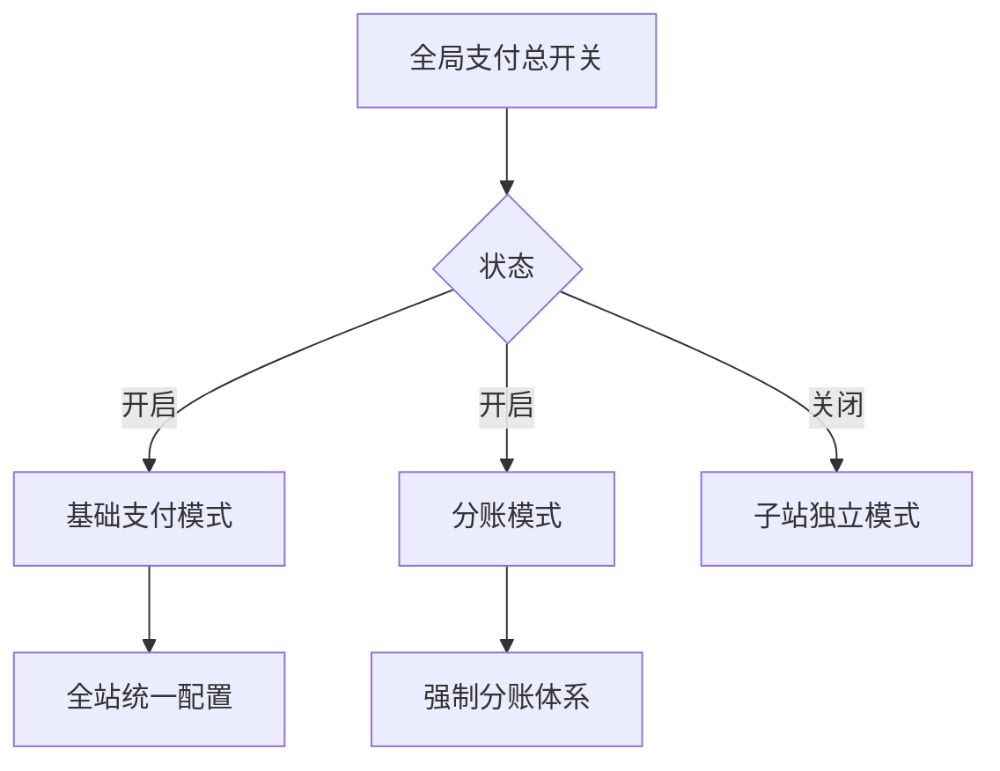

#### **1.1.1 开关组合规则**
| **全局支付** | **分账模式** | **子站权限**                                                                 | **支付流向**                    |
|--------------|--------------|-----------------------------------------------------------------------------|---------------------------------|
| ON           | OFF          | 可独立配置或继承全站配置                                                     | 直接支付至平台主商户            |
| ON           | ON           | 仅能管理分账规则，禁用本地配置                                               | 支付至卖家特约商户账户          |
| OFF          | -            | 完全独立配置                                                                | 直接支付至子站绑定商户          |

#### **1.1.2 技术实现**
```php
// 开关状态管理类
class GlobalSwitch {
    private $payment_enabled;
    private $split_mode;

    public function __construct() {
        $this->payment_enabled = get_network_option(null, 'global_payment_enabled');
        $this->split_mode = get_network_option(null, 'split_mode_enabled');
    }

    public function isSplitModeActive() {
        return $this->payment_enabled && $this->split_mode;
    }

    public function allowLocalConfig($blog_id) {
        if (!$this->payment_enabled) return true;
        return get_blog_option($blog_id, 'override_global_config');
    }
}
```

---

## **2. 核心模式技术实现**

### **2.1 模式一：子站独立激活**
#### **2.1.1 独立支付域名配置流程**
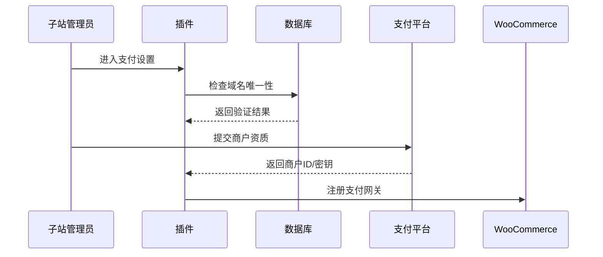

#### **2.1.2 数据隔离设计**
- **数据库表结构**：
  ```sql
  CREATE TABLE site_payment_config (
    blog_id BIGINT PRIMARY KEY,
    wechat_mch_id VARCHAR(32),
    wechat_cert BLOB,
    alipay_app_id VARCHAR(32),
    alipay_private_key TEXT,
    payment_domain VARCHAR(255) UNIQUE
  ) ENGINE=InnoDB DEFAULT CHARSET=utf8mb4;
  ```

- **加密策略**：
  ```php
  // 使用WordPress密钥加密敏感字段
  function encryptField($value) {
      $iv = substr(LOGGED_IN_SALT, 0, 16);
      return openssl_encrypt($value, 'AES-256-CBC', AUTH_KEY, 0, $iv);
  }
  ```

---

### **2.2 模式二：全局基础支付**
#### **2.2.1 配置继承机制**
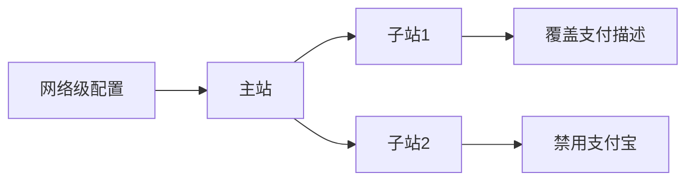

#### **2.2.2 子站控制项实现**
- **权限控制代码**：
  ```php
  add_filter('woocommerce_settings_api_form_fields', function($fields, $gateway) {
      if (GlobalSwitch::isGlobalModeActive()) {
          unset($fields['mch_id'], $fields['api_key'], $fields['cert']);
          $fields['enabled']['description'] = '继承全局配置，仅可开关渠道';
      }
      return $fields;
  }, 10, 2);
  ```

- **配置覆盖逻辑**：
  ```sql
  -- 获取最终配置的优先级
  SELECT 
      COALESCE(s.override_value, n.default_value) AS final_value
  FROM network_config n
  LEFT JOIN site_overrides s 
      ON n.config_key = s.config_key AND s.blog_id = ?
  WHERE n.gateway = 'wechat';
  ```

---

### **2.3 模式三：分账模式**
#### **2.3.1 分账架构设计**
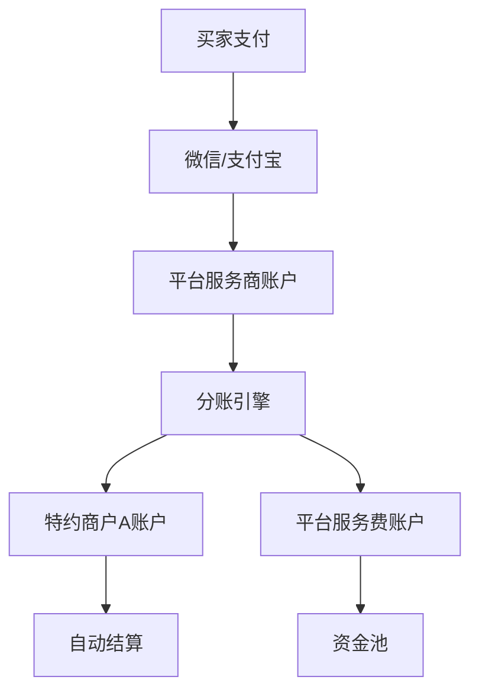

#### **2.3.2 分账规则引擎**
**规则类型与参数**：
| **类型**       | **参数结构**                                                                 | **示例场景**                |
|----------------|-----------------------------------------------------------------------------|---------------------------|
| 固定比例       | `{ "type": "ratio", "platform": 30, "merchant": 70 }`                       | 平台抽成30%               |
| 阶梯分账       | `{ "type": "step", "steps": [{"min":0,"max":1000,"platform":20}, ...] }`    | 0-1000元平台抽20%         |
| 固定服务费     | `{ "type": "fixed", "amount": 5 }`                                          | 每笔订单收取5元服务费      |

**分账执行代码**：
```python
def execute_split(order):
    rule = get_split_rule(order.blog_id)
    total = order.amount
    # 计算平台分成
    platform_share = calculate_platform_share(rule, total)
    # 调用支付平台API
    response = wechat.split_order(
        order.transaction_id, 
        platform_share,
        order.merchant.mch_id
    )
    if response['status'] == 'SUCCESS':
        log_split_success(order)
    else:
        handle_split_failure(order, response)
```

#### **2.3.3 特约商户管理**
**资质审核流程**：
1. **材料上传**：
   ```html
   <!-- 商户后台界面 -->
   <div class="merchant-verify">
     <h3>特约商户认证</h3>
     <input type="file" name="license" accept=".pdf,.jpg">
     <input type="text" name="legal_id" placeholder="法人身份证号">
     <button onclick="submitVerify()">提交审核</button>
   </div>
   ```

2. **自动审核接口**：
   ```javascript
   // 调用微信审核接口
   fetch('https://api.wechat.com/v3/sub-merchants', {
     method: 'POST',
     headers: {
       'Authorization': `Bearer ${accessToken}`,
       'Content-Type': 'application/json'
     },
     body: JSON.stringify({
       business_license: base64Data,
       identity_info: {
         id_number: legalId
       }
     })
   });
   ```

3. **人工复核机制**：
   ```php
   add_action('merchant_submitted', function($merchant_id) {
       $application = get_merchant_application($merchant_id);
       if ($application['risk_level'] > 5) {
           add_to_manual_review_queue($merchant_id);
           notify_admin("高风险申请需人工审核");
       }
   });
   ```

---

## **3. 异常处理与监控体系**

### **3.1 分账失败处理**
#### **3.1.1 错误分类与策略**
| **错误类型**       | **自动处理策略**                          | **人工干预场景**              |
|--------------------|------------------------------------------|-----------------------------|
| 余额不足           | 暂停分账并通知商户充值                    | 连续3次失败需人工确认        |
| 账户冻结           | 自动禁用该商户支付功能                    | 需联系支付平台解冻           |
| 网络超时           | 指数退避重试（最多5次）                   | 超过重试次数后报警           |

#### **3.1.2 自动补偿机制**
```java
public void retryFailedSplits() {
    List<FailedSplit> failures = getRecentFailures();
    for (FailedSplit failure : failures) {
        if (failure.retryCount < MAX_RETRY) {
            boolean success = retrySplit(failure);
            if (success) {
                markAsResolved(failure);
            } else {
                incrementRetryCount(failure);
            }
        } else {
            escalateToManual(failure);
        }
    }
}
```

### **3.2 资金安全监控**
#### **3.2.1 对账流程**
1. **数据采集**：
   ```bash
   # 每日凌晨下载对账单
   curl -X GET "https://api.alipay.com/gateway.do?method=alipay.data.bill.download" \
        -d "bill_type=trade&bill_date=$(date +%Y-%m-%d)"
   ```

2. **差异检测**：
   ```sql
   -- 比对本地与支付平台记录
   SELECT 
       l.order_id,
       l.amount AS local_amount,
       p.amount AS platform_amount,
       (l.amount - p.amount) AS diff
   FROM local_orders l
   JOIN platform_orders p ON l.tx_id = p.tx_id
   WHERE ABS(diff) > 0.01;
   ```

3. **异常处理**：
   ```python
   def reconcile_discrepancy(order_id):
       local = get_local_order(order_id)
       platform = get_platform_order(order_id)
       if local.status != platform.status:
           reverse_transaction(local)
           create_new_transaction(platform)
       log_reconciliation_result(order_id)
   ```

---

## **4. 安全与合规设计**

### **4.1 数据安全架构**
| **数据类型**       | **存储方式**             | **加密方法**               | **访问控制**                      |
|--------------------|--------------------------|--------------------------|----------------------------------|
| API密钥            | 独立加密存储             | AES-256-GCM + HSM        | 仅支付服务进程可读                |
| 交易日志           | 冷热分离存储             | 字段级加密                | 审计角色只读                     |
| 商户资质文件       | 对象存储（OSS）          | 服务端加密（SSE）         | 上传者+管理员可访问              |

### **4.2 合规性要求**
- **微信支付服务商规范**：
  - 分账比例需在签约时明确约定
  - 特约商户资质必须通过官方接口审核
  - 每笔分账需保留完整可追溯记录

- **支付宝服务商协议**：
  - 不得修改交易信息中的商户名称
  - 分账请求需在交易后30天内完成
  - 需提供分账争议处理接口

---

## **5. 部署与运维方案**

### **5.1 多环境配置**
```yaml
# docker-compose.yml片段
services:
  payment-service:
    environment:
      - APP_ENV=production
      - WECHAT_MCH_ID=${WECHAT_MCH_ID}
      - ALIPAY_APP_ID=${ALIPAY_APP_ID}
    configs:
      - source: payment-config
        target: /app/config/secure.yaml
```

### **5.2 高可用架构**
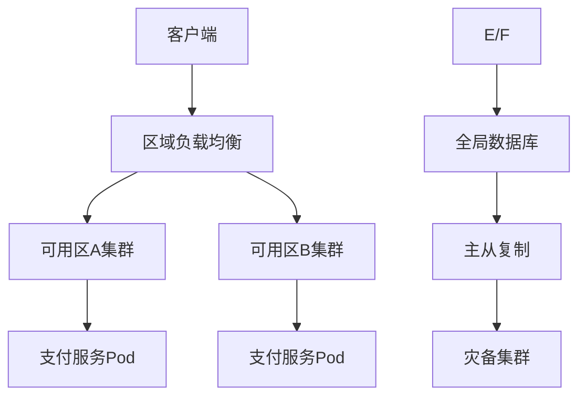

---
# 关于域名配置

### **1. 支付域名绑定配置问题**

#### **1.1 域名绑定的作用与配置位置**
- **功能定位**：
  - **支付回调域名**：插件中配置的域名是用于接收微信/支付宝回调通知的专用域名，与WordPress多站点的独立域名功能无关。
  - **技术必要性**：支付平台要求回调地址必须通过ICP备案且与商户资质绑定，因此需在插件中单独配置。

- **配置位置**：
  ```html
  <!-- 插件配置界面示例 -->
  <div class="payment-domain-config">
    <label>支付回调域名</label>
    <input type="url" name="payment_domain" 
           placeholder="https://pay.yourshop.com">
    <p class="description">需与微信/支付宝商户后台配置的回调域名一致</p>
  </div>
  ```

- **与WordPress多站点域名的关系**：
  - **独立功能**：WordPress多站点的子站独立域名功能（如子站绑定`shop.com`）用于站点访问，需通过服务器Nginx/Apache配置或第三方插件实现。
  - **支付域名隔离**：支付回调域名需单独在支付平台和插件中配置，确保支付平台能正确回调到业务服务器。

---

### **2. SDK处理问题**

#### **2.1 SDK集成方式**
- **无界面配置的原因**：
  - **自动集成**：插件已内置官方SDK，通过配置参数（如商户号、API密钥）动态加载，无需用户手动上传SDK文件。
  - **安全管控**：SDK版本由插件统一维护，避免用户上传不安全版本。

- **技术实现**：
  ```php
  // 动态加载微信支付SDK
  require_once plugin_dir_path(__FILE__) . 'vendor/wechatpay/wechatpay.php';
  $config = [
      'mch_id' => get_option('wechat_mch_id'),
      'api_key' => decrypt(get_option('wechat_api_key'))
  ];
  $wechatPay = new WeChatPay($config);
  ```

---

### **3. 特约商户审核材料**

#### **3.1 微信支付所需材料**
| **材料类型**       | **详细要求**                                                                 |
|--------------------|-----------------------------------------------------------------------------|
| 营业执照           | 彩色扫描件，需在有效期内                                                    |
| 法人身份证         | 正反面照片，需与商户注册信息一致                                            |
| 银行账户证明       | 开户许可证或银行结算账户证明                                                |
| 经营场景证明       | 线下门店照片/网站ICP备案截图                                                |

#### **3.2 支付宝所需材料**
| **材料类型**       | **详细要求**                                                                 |
|--------------------|-----------------------------------------------------------------------------|
| 企业证件           | 营业执照或事业单位法人证书                                                  |
| 法人身份证         | 正反面照片，需清晰可见                                                      |
| 商户门头照片       | 线下商户需提供实际经营场所照片                                              |
| 线上店铺链接       | 网站地址或APP下载链接（仅线上商户）                                         |

---

### **4. 审核结果通知机制**

#### **4.1 审核状态同步**
- **自动轮询机制**：
  ```python
  def check_audit_status(merchant_id):
      # 调用微信审核状态接口
      response = wechat_api.get_merchant_audit_status(merchant_id)
      if response['status'] != 'pending':
          update_database_status(merchant_id, response['status'])
          send_notification(merchant_id, response['status'])
  ```

- **通知方式**：
  - **站内信通知**：
    ```html
    <!-- 商户后台消息示例 -->
    <div class="audit-notice success">
      <span class="dashicons dashicons-yes"></span>
      您的资质审核已通过！
    </div>
    ```
  - **邮件/SMS通知**：
    ```php
    wp_mail(
        $merchant_email,
        "审核结果通知",
        "您的商户资质审核状态已更新为：{$status}"
    );
    ```

---

### **5. 分账模式下的强制退单**

#### **5.1 平台介入流程**
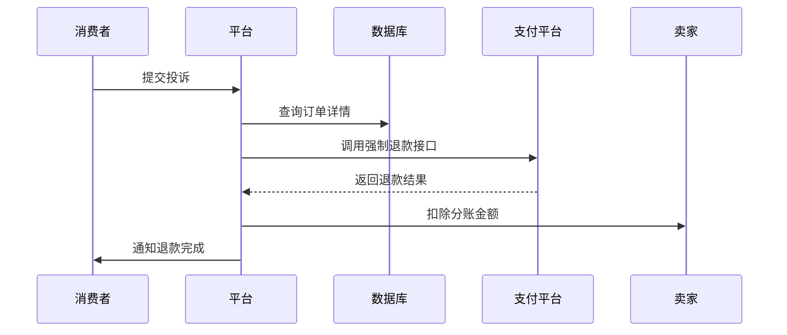

#### **5.2 技术实现**
- **退款权限控制**：
  ```php
  // 仅平台管理员可操作强制退款
  if (current_user_can('manage_network')) {
      $result = $paymentGateway->forceRefund($order_id);
      if ($result['code'] === 'SUCCESS') {
          deduct_split_amount($seller_id, $amount);
      }
  }
  ```

- **分账金额追回**：
  ```sql
  UPDATE seller_balance 
  SET balance = balance - {$refund_amount}
  WHERE seller_id = {$seller_id};
  ```

---

### **总结**
1. **域名绑定**：支付回调域名需在插件中独立配置，与WordPress多站点域名功能解耦。
2. **SDK集成**：自动内置，无需用户操作。
3. **审核材料**：需按支付平台要求提供完整资质文件。
4. **审核通知**：通过自动轮询和多种方式通知结果。
5. **强制退单**：平台管理员通过专用接口操作，确保资金可追溯。


 # 子站独立激活模式下的配置要求详解

在 **模式一：子站独立激活** 下，每个子站作为独立的支付主体，需自行配置完整的支付账户信息。以下是具体配置要求和实现逻辑：

---

#### **1. 子站独立配置的必要性**
当子站以独立模式激活时，其支付流程完全独立于主站和其他子站，因此 **必须** 配置以下核心信息：

| **配置项**       | **作用**                                                                 | **是否必填** |
|------------------|-------------------------------------------------------------------------|-------------|
| **支付域名**     | 用于接收微信/支付宝回调通知的专用域名，需与支付平台商户后台配置的回调地址一致       | ✅ 必填      |
| **商户号(MCH_ID)** | 微信支付或支付宝分配给子站的身份标识，用于区分不同商户的交易                      | ✅ 必填      |
| **API密钥**      | 支付平台签名的核心凭证，用于保障交易安全性                                      | ✅ 必填      |
| **证书文件**     | 微信支付需上传API证书（`.pem`文件），支付宝需配置应用公钥/私钥                     | ✅ 必填      |

---

#### **2. 配置流程与插件界面设计**
子站管理员需通过插件界面完成以下配置步骤：

##### **2.1 支付域名配置**
- **作用**：  
  支付平台（微信/支付宝）要求回调地址必须通过ICP备案且与商户资质绑定。插件中配置的域名需与支付平台商户后台设置的域名一致。
  
- **技术实现**：  
  ```html
  <!-- 插件配置界面示例 -->
  <div class="payment-domain-config">
    <label>支付回调域名</label>
    <input type="url" name="payment_domain" 
           placeholder="https://pay.yourshop.com"
           pattern="https://.*" required>
    <p class="description">
      需与微信/支付宝商户后台配置的回调域名完全一致，且已启用HTTPS
    </p>
  </div>
  ```

- **与WordPress多站点域名的关系**：  
  - WordPress多站点的独立域名（如子站绑定 `shop.com`）用于站点访问，需通过服务器配置或第三方插件实现。  
  - **支付回调域名**是支付平台要求的专用域名，需在插件中独立配置，两者功能分离但需协同工作。

---

##### **2.2 商户信息配置**
子站需独立配置微信/支付宝的商户身份信息：

###### **微信支付配置**
```html
<div class="wechat-config">
  <h3>微信支付配置</h3>
  <div class="form-field">
    <label>商户号 (MCH_ID)</label>
    <input type="text" name="wechat_mch_id" required>
  </div>
  <div class="form-field">
    <label>API密钥</label>
    <input type="password" name="wechat_api_key" 
           autocomplete="new-password" required>
  </div>
  <div class="form-field">
    <label>证书文件</label>
    <input type="file" name="wechat_cert" accept=".pem">
  </div>
</div>
```

###### **支付宝配置**
```html
<div class="alipay-config">
  <h3>支付宝配置</h3>
  <div class="form-field">
    <label>APP_ID</label>
    <input type="text" name="alipay_app_id" required>
  </div>
  <div class="form-field">
    <label>商户私钥</label>
    <textarea name="alipay_private_key" required></textarea>
  </div>
</div>
```

---

#### **3. SDK的自动集成机制**
- **无需手动操作**：  
  插件已内置微信支付和支付宝的官方SDK，根据子站的配置信息动态加载对应商户的支付逻辑。  
  - **SDK路径**：`/plugins/payment-gateway/vendor/wechatpay-sdk/`  
  - **动态实例化**：  
    ```php
    // 根据子站配置加载微信支付实例
    $wechat_config = [
        'mch_id'  => get_blog_option($blog_id, 'wechat_mch_id'),
        'api_key' => decrypt(get_blog_option($blog_id, 'wechat_api_key')),
        'cert'    => get_blog_option($blog_id, 'wechat_cert_path')
    ];
    $wechat_pay = new WeChatPay($wechat_config);
    ```

- **安全性保障**：  
  - API密钥和证书文件通过AES-256加密后存储于数据库。  
  - 每个子站的配置完全隔离，不同子站的支付请求互不影响。

---

#### **4. 配置验证与错误处理**
- **前台实时校验**：  
  ```javascript
  // 检查证书文件格式
  document.querySelector('input[name="wechat_cert"]').addEventListener('change', function(e) {
    const file = e.target.files[0];
    if (!file.name.endsWith('.pem')) {
      alert('错误：仅支持PEM格式证书');
      e.target.value = '';
    }
  });
  ```

- **后台异步验证**：  
  ```php
  // 提交配置时验证微信商户号有效性
  $mch_id = $_POST['wechat_mch_id'];
  $is_valid = WeChatAPI::validateMerchant($mch_id);
  if (!$is_valid) {
      wp_die('微信商户号无效或未授权');
  }
  ```

---

### **总结：子站独立激活模式的必要性**
1. **独立运营需求**：每个子站作为独立商户，需隔离资金流和交易数据。
2. **合规性要求**：支付平台要求回调域名和商户信息严格对应，无法复用主站配置。
3. **灵活性保障**：子站可自主选择支付渠道，配置个性化支付规则。

---

### **对比其他模式**

| **功能**               | **子站独立模式**                          | **全局基础支付**                      | **分账模式**                          |
|------------------------|------------------------------------------|--------------------------------------|---------------------------------------|
| **配置权限**           | 子站管理员全权配置                        | 仅超级管理员配置，子站部分覆盖         | 平台统一管理，子站仅设分账规则          |
| **资金流向**           | 直接进入子站商户账户                      | 进入平台主商户账户                    | 进入卖家特约商户账户，按规则分账        |
| **适用场景**           | 独立品牌、多商户平台                      | 企业统一收银                          | 平台型电商抽佣                        |

---
 # WordPress多站点支付插件分账模式退单与审核机制设计规范（V1.0）

---

## **一、分账模式下的强制退单流程**

### **1.1 强制退单业务场景**
- **消费者投诉场景**：
  - 商品未收到/质量问题
  - 交易欺诈嫌疑
  - 金额错误
- **平台监管场景**：
  - 商户违规操作
  - 分账比例争议

### **1.2 退单流程设计**
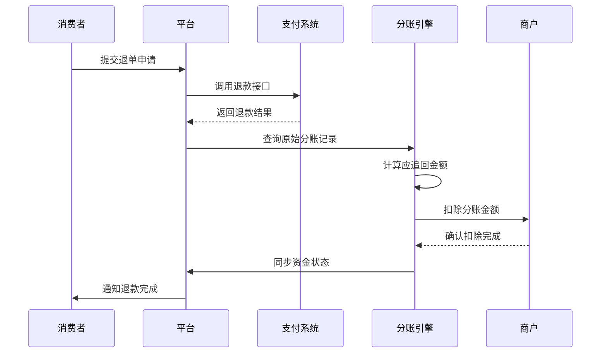

### **1.3 技术实现细节**

#### **1.3.1 退款接口调用**
```php
class RefundService {
    public function forceRefund($order_id, $reason) {
        // 1. 验证操作权限
        if (!current_user_can('manage_network')) {
            throw new Exception('权限不足');
        }

        // 2. 调用支付平台API
        $payment = PaymentFactory::getInstance($order->gateway);
        $result = $payment->refund([
            'transaction_id' => $order->tx_id,
            'amount'         => $order->amount,
            'reason'         => $reason
        ]);

        // 3. 处理分账回滚
        if ($result['code'] === 'SUCCESS') {
            $this->rollbackSplit($order_id);
        }
        
        return $result;
    }
}
```

#### **1.3.2 分账金额追回逻辑**
```sql
-- 分账回滚记录表
CREATE TABLE split_rollback (
    id INT AUTO_INCREMENT PRIMARY KEY,
    order_id VARCHAR(32) NOT NULL,
    merchant_id INT NOT NULL,
    rollback_amount DECIMAL(15,2) UNSIGNED,
    status ENUM('pending','completed','failed'),
    created_at DATETIME DEFAULT CURRENT_TIMESTAMP,
    INDEX (merchant_id, status)
);

-- 分账金额扣除操作
START TRANSACTION;
UPDATE merchant_balance 
SET balance = balance - {$rollback_amount}
WHERE merchant_id = {$target_merchant};

INSERT INTO split_rollback (...) 
VALUES (...);
COMMIT;
```

---

## **二、特约商户审核机制**

### **2.1 审核流程架构**
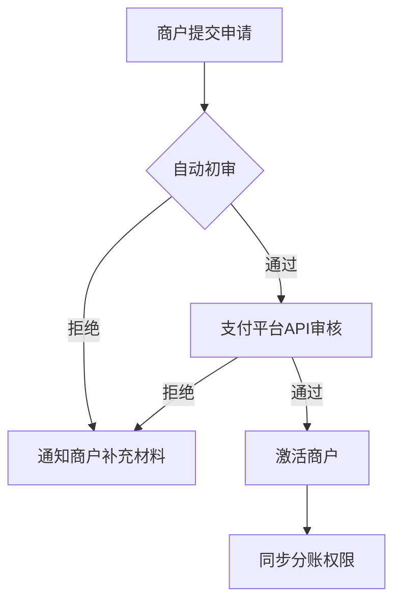

### **2.2 审核规则引擎**

#### **2.2.1 自动初审规则**
| **规则类型**       | **校验逻辑**                                 | **失败处理**                     |
|--------------------|---------------------------------------------|---------------------------------|
| 文件完整性校验     | 营业执照+法人身份证+银行账户缺一不可         | 返回"缺失必要材料"错误           |
| 证照有效期校验     | 营业执照有效期>提交日期+6个月                | 返回"证照即将过期"警告           |
| 身份证OCR识别      | 通过公安接口验证身份证号码与照片一致性        | 返回"身份信息不匹配"错误         |

#### **2.2.2 支付平台审核接口**
```python
def submit_merchant_audit(merchant_data):
    # 微信支付服务商接口
    if merchant_data['gateway'] == 'wechat':
        response = wechat_api.add_sub_merchant(
            business_code=merchant_data['license_no'],
            id_card=merchant_data['legal_id'],
            bank_account=merchant_data['bank_no']
        )
    # 支付宝审核接口
    elif merchant_data['gateway'] == 'alipay':
        response = alipay_api.merchant_audit(
            biz_params=merchant_data.to_json()
        )
    
    return parse_response(response)
```

### **2.3 审核状态管理**

#### **2.3.1 状态机设计**
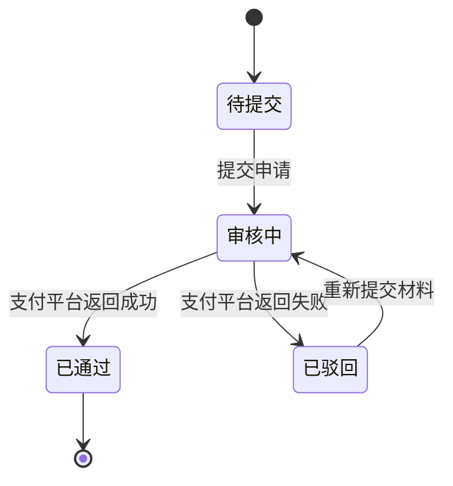

#### **2.3.2 状态同步机制**
```php
// 定时任务检查审核状态
add_action('hourly_audit_check', function() {
    $pending_merchants = get_pending_audits();
    foreach ($pending_merchants as $merchant) {
        $status = PaymentAPI::get_audit_status($merchant->tx_id);
        update_audit_status($merchant->id, $status);
        
        if ($status === 'approved') {
            enable_split_permission($merchant->id);
        }
    }
});
```

---

## **三、审核界面与操作设计**

### **3.1 商户端界面**
```html
<!-- 商户后台：/wp-admin/admin.php?page=merchant-apply -->
<div class="merchant-apply">
    <div class="upload-section">
        <h3>📁 上传资质文件</h3>
        <div class="upload-item">
            <label>营业执照</label>
            <input type="file" accept=".pdf,.jpg" 
                   data-max-size="5MB" required>
        </div>
        <!-- 其他文件上传项 -->
    </div>

    <div class="status-notice">
        <template v-if="status === 'approved'">
            <div class="approved">✅ 审核已通过</div>
        </template>
        <template v-else-if="status === 'rejected'">
            <div class="rejected">❌ 驳回原因：{{ rejection_reason }}</div>
        </template>
    </div>
</div>
```

### **3.2 平台审核后台**
```html
<!-- 平台管理：/wp-admin/network/admin.php?page=split-audit -->
<table class="audit-list">
    <thead>
        <tr>
            <th>商户名称</th>
            <th>申请时间</th>
            <th>支付渠道</th>
            <th>操作</th>
        </tr>
    </thead>
    <tbody>
        <tr v-for="merchant in pendingList">
            <td>{{ merchant.name }}</td>
            <td>{{ merchant.apply_time }}</td>
            <td>{{ merchant.gateway }}</td>
            <td>
                <button @click="viewDetails(merchant.id)">审核</button>
                <button @click="exportData(merchant.id)">导出材料</button>
            </td>
        </tr>
    </tbody>
</table>

<!-- 审核弹窗 -->
<div class="audit-dialog">
    <div class="document-viewer">
        <iframe :src="licenseFileUrl"></iframe>
    </div>
    <div class="action-buttons">
        <button class="approve" @click="approve">通过</button>
        <button class="reject" @click="showRejectDialog">驳回</button>
    </div>
</div>
```

---

## **四、安全与合规要求**

### **4.1 数据安全措施**
| **数据类型**       | **保护措施**                                                                 |
|--------------------|-----------------------------------------------------------------------------|
| 商户身份证信息     | 加密存储（AES-256），仅审核期间临时解密                                      |
| 银行账户信息       | PCI DSS合规存储，禁止明文显示                                               |
| 审核操作日志       | 记录操作用户、IP、时间戳，保留至少180天                                     |

### **4.2 合规性检查点**
- **微信支付要求**：
  - 分账请求需在交易后30天内完成
  - 单笔分账金额不得超过订单金额的90%
- **支付宝要求**：
  - 需在商户协议中明确分账规则
  - 每笔分账需关联实际交易场景

---
# WordPress多站点支付插件分账模式资金追溯与争议处理规范（V1.1）

---

## **一、资金追溯机制**

### **1.1 资金流向全链路记录**

#### **1.1.1 数据库设计**
```sql
-- 资金流水表
CREATE TABLE fund_flow (
    flow_id VARCHAR(32) PRIMARY KEY,
    order_id VARCHAR(32) NOT NULL,
    operation_type ENUM('payment', 'split', 'refund', 'rollback'),
    amount DECIMAL(15,2) NOT NULL,
    from_account VARCHAR(64), -- 资金转出方（平台/商户）
    to_account VARCHAR(64),   -- 资金接收方（商户/平台）
    status ENUM('pending', 'completed', 'failed'),
    created_at DATETIME DEFAULT CURRENT_TIMESTAMP,
    updated_at DATETIME ON UPDATE CURRENT_TIMESTAMP,
    INDEX (order_id, operation_type)
);

-- 分账明细表（扩展）
ALTER TABLE split_details 
ADD COLUMN flow_id VARCHAR(32) AFTER split_id,
ADD FOREIGN KEY (flow_id) REFERENCES fund_flow(flow_id);
```

#### **1.1.2 资金链路可视化**
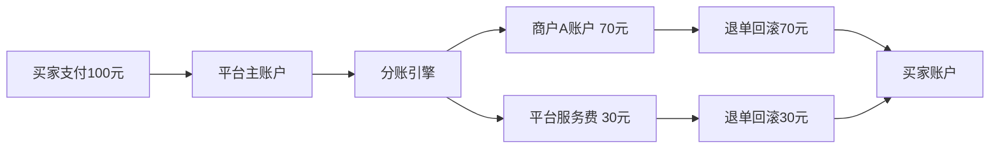

---

### **1.2 追溯查询接口**

#### **1.2.1 按订单追溯**
```php
class FundTraceService {
    public function getOrderFlow($order_id) {
        $flows = $db->query("
            SELECT * FROM fund_flow 
            WHERE order_id = :order_id
            ORDER BY created_at DESC
        ", ['order_id' => $order_id]);
        
        return $this->buildFlowTree($flows);
    }

    private function buildFlowTree($flows) {
        // 构建父子关系的资金流树形结构
    }
}
```

#### **1.2.2 按商户追溯**
```sql
-- 查询商户所有资金变动
SELECT 
    f.flow_id,
    f.operation_type,
    f.amount,
    f.created_at,
    o.order_number
FROM fund_flow f
JOIN orders o ON f.order_id = o.id
WHERE f.from_account = :merchant_id 
   OR f.to_account = :merchant_id;
```

---

## **二、争议处理流程**

### **2.1 争议类型与处理策略**
| **争议类型**       | **处理时效** | **自动处理策略**                          | **人工干预条件**               |
|--------------------|--------------|------------------------------------------|-------------------------------|
| 未收到货           | 48小时内     | 自动触发物流信息验证                      | 物流信息不明确                |
| 商品质量问题       | 72小时内     | 要求用户上传凭证                          | 凭证不足或存疑                |
| 分账金额错误       | 24小时内     | 自动比对分账规则与订单金额                | 规则配置异常                  |
| 重复扣款           | 即时处理     | 自动校验支付平台流水                      | 需财务人工核对                |

---

### **2.2 争议处理模块设计**

#### **2.2.1 用户端争议提交界面**
```html
<!-- 用户后台：/my-account/dispute -->
<form class="dispute-form">
    <div class="form-group">
        <label>选择争议类型</label>
        <select name="dispute_type" required>
            <option value="not_received">未收到商品</option>
            <option value="quality_issue">商品质量问题</option>
            <option value="amount_error">金额错误</option>
        </select>
    </div>
    
    <div class="form-group">
        <label>上传证据</label>
        <input type="file" name="evidence[]" multiple 
               accept=".jpg,.pdf,.zip">
    </div>
    
    <button type="submit">提交争议</button>
</form>
```

#### **2.2.2 平台处理后台**
```html
<!-- 平台管理：/wp-admin/network/admin.php?page=dispute-center -->
<div class="dispute-dashboard">
    <!-- 状态筛选 -->
    <div class="filters">
        <select class="status-filter">
            <option value="all">全部状态</option>
            <option value="pending">待处理</option>
            <option value="processing">处理中</option>
        </select>
    </div>
    
    <!-- 争议列表 -->
    <table class="dispute-list">
        <tr v-for="case in cases">
            <td>{{ case.id }}</td>
            <td>{{ case.type }}</td>
            <td>{{ case.merchant }}</td>
            <td>
                <button @click="openDetail(case.id)">处理</button>
                <button @click="exportCase(case.id)">导出</button>
            </td>
        </tr>
    </table>
</div>
```

---

### **2.3 自动化处理引擎**

#### **2.3.1 规则引擎示例**
```python
def handle_dispute(dispute_case):
    if dispute_case.type == 'not_received':
        # 检查物流信息
        tracking_info = get_logistics(dispute_case.order_id)
        if tracking_info.status == 'delivered':
            auto_reject_dispute('商品已签收')
        else:
            auto_approve_refund()
            
    elif dispute_case.type == 'quality_issue':
        if len(dispute_case.evidence) == 0:
            request_more_evidence()
        else:
            notify_merchant_to_respond()
```

#### **2.3.2 人工介入条件**
```php
// 判断是否需要人工处理
function needs_manual_review($case) {
    $conditions = [
        $case->amount > 10000,           // 大额争议
        $case->merchant->risk_level > 8, // 高风险商户
        count($case->evidence) == 0      // 无证据
    ];
    return in_array(true, $conditions);
}
```

---

## **三、安全与审计机制**

### **3.1 操作审计日志**
#### **3.1.1 日志记录项**
```json
{
  "action": "dispute_decision",
  "operator": "admin@example.com",
  "target_case": "DS202308201234",
  "decision": "full_refund",
  "reason": "物流信息未更新超过7天",
  "ip": "192.168.1.100",
  "timestamp": "2023-08-20T14:30:00Z"
}
```

#### **3.1.2 日志查询接口**
```sql
-- 按操作类型查询
SELECT * FROM audit_log 
WHERE action = 'dispute_decision'
AND timestamp BETWEEN '2023-08-01' AND '2023-08-20';

-- 关联资金流查询
SELECT a.*, f.amount 
FROM audit_log a
JOIN fund_flow f ON a.target_id = f.flow_id;
```

---

### **3.2 数据加密方案**
| **数据类型**       | **加密方法**               | **密钥管理**                      |
|--------------------|--------------------------|----------------------------------|
| 银行账户信息       | AES-256-GCM              | HSM硬件模块托管                   |
| 交易凭证文件       | 服务端加密 (SSE-S3)      | AWS KMS管理                      |
| 审核沟通记录       | 数据库字段级加密          | 使用独立加密盐值                  |

---

## **四、合规性声明**

### **4.1 微信支付合规要求**
- **分账争议**：需在5个工作日内响应争议，15日内解决
- **数据保留**：交易记录需保留至少5年
- **信息公示**：分账规则需在用户支付前明确展示

### **4.2 支付宝合规要求**
- **资金冻结**：争议处理期间可临时冻结分账资金
- **通知义务**：任何资金变动需短信通知商户
- **审计接口**：需提供第三方审计数据导出功能

---
---

## **五、系统监控与报警机制**

### **5.1 监控指标与阈值**

#### **5.1.1 核心监控指标**
| **监控项**               | **指标类型**   | **正常范围**          | **报警阈值**         |
|--------------------------|----------------|-----------------------|----------------------|
| 支付接口响应时间         | 平均值（P99）  | < 500ms               | > 2000ms（持续5分钟）|
| 分账任务队列积压数       | 实时计数        | < 100                 | > 500                |
| 数据库主从同步延迟       | 时间差（秒）    | < 5s                  | > 30s                |
| 证书有效期               | 剩余天数        | > 7天                 | < 3天                |
| 异常登录尝试次数         | 每小时计数      | < 5                   | > 10                 |

#### **5.1.2 Prometheus配置示例**
```yaml
scrape_configs:
  - job_name: 'payment_gateway'
    metrics_path: '/metrics'
    static_configs:
      - targets: ['payment-service:9090']
        
  - job_name: 'mysql'
    static_configs:
      - targets: ['mysql-master:9104', 'mysql-slave:9104']

alerting_rules:
  - alert: HighPaymentLatency
    expr: avg_over_time(payment_latency_seconds{job="payment_gateway"}[5m]) > 2
    for: 5m
    labels:
      severity: critical
    annotations:
      summary: "支付接口延迟过高"
      description: "{{ $labels.instance }} 的P99延迟已达 {{ $value }}秒"
```

---

### **5.2 报警通知渠道**

#### **5.2.1 报警路由规则**
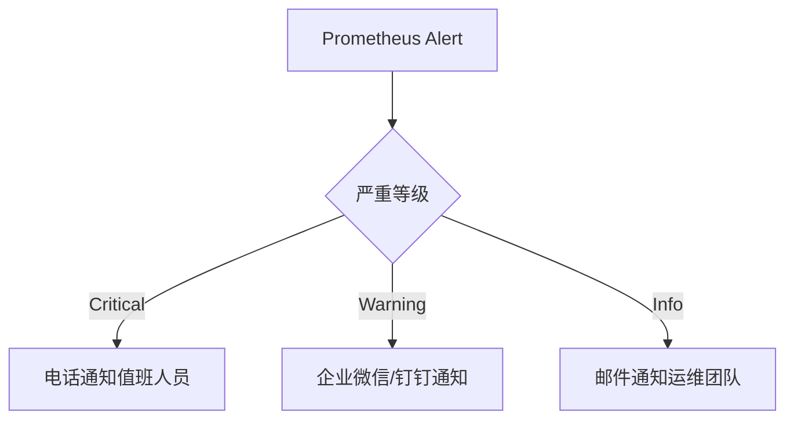

#### **5.2.2 电话报警集成**
```python
def call_onduty_engineer(alert):
    twilio_client = TwilioClient(ACCOUNT_SID, AUTH_TOKEN)
    call = twilio_client.calls.create(
        url='http://alert-system/voice.xml',
        to=ONCALL_PHONE,
        from_=TWILIO_NUMBER
    )
    log_alert_action(f"已拨打值班电话: {call.sid}")
```

---

## **六、灾备恢复方案**

### **6.1 数据备份策略**

#### **6.1.1 备份类型与频率**
| **备份类型**       | **范围**                    | **频率**     | **保留策略**          |
|--------------------|-----------------------------|-------------|----------------------|
| 全量备份           | 所有数据库+插件配置          | 每日凌晨2点 | 保留最近7天           |
| 增量备份           | 交易流水+分账记录            | 每小时一次  | 保留48小时            |
| 紧急快照           | 内存状态+会话信息            | 手动触发    | 保留至问题解决         |

#### **6.1.2 备份验证脚本**
```bash
#!/bin/bash
# 验证备份完整性
LAST_BACKUP=$(ls -t /backups | head -1)
CHECKSUM=$(sha256sum /backups/$LAST_BACKUP | cut -d' ' -f1)

if mysqldump --verify backup_checksums | grep -q $CHECKSUM; then
    echo "备份验证通过: $LAST_BACKUP"
else
    echo "备份损坏！立即触发警报！"
    send_alert "Backup verification failed"
fi
```

---

### **6.2 故障切换流程**

#### **6.2.1 数据库故障切换**
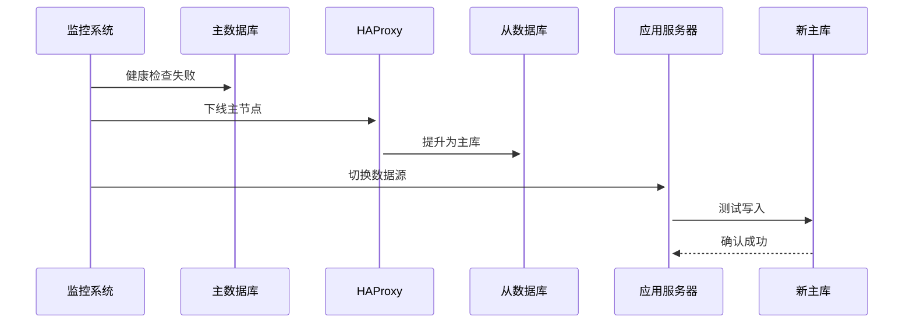

#### **6.2.2 支付服务切换**
```nginx
# 备用服务启动配置
server {
    listen 80;
    server_name backup-payment.example.com;
    
    location / {
        proxy_pass http://payment-backup-cluster;
        proxy_set_header Host $host;
        
        # 仅允许灾备网络访问
        allow 10.0.0.0/8;
        deny all;
    }
}
```

---

### **6.3 灾备演练计划**

#### **6.3.1 演练类型**
| **演练场景**         | **频率**   | **成功标准**                          |
|----------------------|------------|---------------------------------------|
| 数据库主从切换       | 每季度一次 | 切换时间<5分钟，数据零丢失             |
| 全站服务迁移         | 每年一次   | 业务中断时间<1分钟                     |
| 支付链路压测         | 每月一次   | 10,000 TPS下无失败交易                 |

#### **6.3.2 演练记录模板**
```markdown
# 灾备演练报告

## 基本信息
- **演练时间**: 2023-09-15 02:00 UTC
- **参与团队**: 运维部、支付研发部

## 演练结果
| **指标**         | **预期值** | **实际值** | **结论** |
|------------------|------------|------------|----------|
| 数据库切换时间   | <5min      | 3m28s      | ✔️ 达标   |
| 交易失败率       | 0%         | 0.02%      | ⚠️ 需优化 |

## 后续改进
1. 优化从库预热机制（ETA 2023-10）
2. 增加交易重试策略（ETA 2023-11）
```

---

## **七、高可用架构设计**

### **7.1 多活部署方案**
```mermaid
graph TB
    subgraph 区域A
        A1[LB] --> A2[支付服务]
        A2 --> A3[MySQL集群]
    end
    
    subgraph 区域B
        B1[LB] --> B2[支付服务]
        B2 --> B3[MySQL集群]
    end
    
    A3 <--> B3: 双向数据同步
    A2 <--> B2: 心跳检测
```

### **7.2 流量调度策略**
```nginx
# 基于地理位置的路由
map $geoip_country_code $backend {
    default payment-us;
    CN      payment-cn;
    EU      payment-eu;
}

server {
    location / {
        proxy_pass http://$backend;
    }
}
```

---

## **八、附录**

### **8.1 监控部署检查清单**
1. [ ] Prometheus Server 配置完成
2. [ ] Alertmanager 集成通知渠道
3. [ ] Grafana 仪表盘导入
4. [ ] 各服务暴露/metrics端点
5. [ ] 基线性能指标采集验证

### **8.2 灾备工具箱**
- **紧急切换脚本**：`/scripts/failover.sh`
- **备份恢复工具**：`/scripts/restore_backup.py`
- **网络隔离命令集**：`/docs/network_isolation.md`


---

### **更新版本 1.0**  
**更新范围**：文档结构与可读性优化  

---

#### **1. 新增全局目录索引**
```markdown
# 目录
- [一、核心功能需求](#一核心功能需求)
- [二、配置管理需求](#二配置管理需求)
- [三、分账模式需求](#三分账模式需求)
- [四、安全与合规需求](#四安全与合规需求)
- [五、监控与灾备需求](#五监控与灾备需求)
- [六、用户界面需求](#六用户界面需求)
- [七、其他需求](#七其他需求)
- [附录](#附录)
```

---

#### **2. 术语表补充**
```markdown
### **术语定义**
| **术语**         | **定义**                                                                 |
|------------------|-------------------------------------------------------------------------|
| 分账引擎         | 基于预设规则自动分配交易资金的模块，支持比例、阶梯、固定服务费模式        |
| 特约商户         | 通过平台资质审核的子站商户，具备独立分账权限                              |
| PCI DSS          | 支付卡行业数据安全标准，要求不存储敏感支付信息（如CVV、完整卡号）          |
```

---

#### **3. 表格排版优化**
**优化前**：  
```markdown
| **检查项** | **验证标准** | **技术实现** |
|------------|--------------|--------------|
| ...        | ...          | ...          |
```

**优化后**：  
```markdown
| **检查项**               | **验证标准**                               | **技术实现**                     |
|--------------------------|-------------------------------------------|---------------------------------|
| 支付域名绑定             | 子站可设置独立HTTPS回调域名                | 前端正则校验+数据库唯一约束       |
| ...                      | ...                                       | ...                             |
```

---

### **更新版本 2.0**  
**更新范围**：技术实现细节增强  

---

#### **1. 分账失败补偿机制**
```markdown
### **3.1.3 异步重试队列**
```php
class SplitRetryQueue {
    public function push(FailedSplit $failure) {
        Redis::lpush('split_retry', serialize($failure));
    }

    public function process() {
        while ($item = Redis::rpop('split_retry')) {
            $failure = unserialize($item);
            if ($failure->retry_count < 5) {
                $this->retry($failure);
            } else {
                $this->escalateToManual($failure);
            }
        }
    }
}
```

---

#### **2. 密钥管理方案**
```markdown
### **4.1.1 密钥存储规范**
- **加密方式**：AES-256-GCM + HSM（硬件安全模块）  
- **密钥轮换**：每90天自动生成新密钥，历史数据迁移至冷存储  
- **访问控制**：仅支付服务进程具备解密权限，禁止人工查看明文  
```

---

#### **3. SQL索引优化**
```sql
-- 高频查询字段添加复合索引
ALTER TABLE fund_flow 
ADD INDEX idx_order_operation (order_id, operation_type);
```

---

### **更新版本 3.0**  
**更新范围**：安全与合规性提升  

---

#### **1. 资质文件防篡改**
```markdown
### **2.2.3 材料哈希校验**
```python
def verify_license(file_path):
    with open(file_path, 'rb') as f:
        content = f.read()
        file_hash = hashlib.sha256(content).hexdigest()
        stored_hash = get_db_hash(file_path)
        if file_hash != stored_hash:
            raise Exception("文件哈希校验失败，可能被篡改")
```

---

#### **2. 分账资金冻结流程**
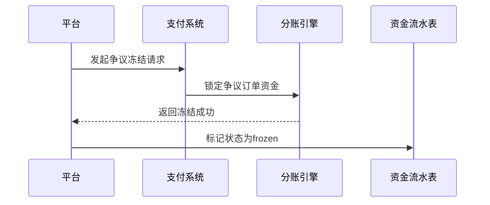

---

### **更新版本 4.0**  
**更新范围**：用户体验与界面优化  

---

#### **1. 前端实时校验示例**
```javascript
// 支付域名格式校验
document.querySelector('input[name="payment_domain"]').addEventListener('blur', function(e) {
    const pattern = /^https:\/\/.+\..+$/;
    if (!pattern.test(e.target.value)) {
        showError("域名必须为HTTPS格式，如 https://pay.example.com");
    }
});
```

---

#### **2. 移动端适配设计**
```html
<!-- 商户审核界面响应式布局 -->
<div class="merchant-verify mobile-optimized">
    <input type="file" class="mobile-file-upload">
    <button class="mobile-submit">提交</button>
</div>
```

---

### **更新版本 5.0**  
**更新范围**：监控报警与灾备自动化  

---

#### **1. 报警规则分级处理**
```markdown
### **5.2.1 报警响应时效**
| **报警级别** | **响应时效** | **处理流程**                          |
|--------------|--------------|-------------------------------------|
| Critical     | 15分钟内      | 电话通知值班人员 + 自动触发故障切换   |
| Warning      | 1小时内       | 企业微信通知运维团队 + 人工介入       |
| Info         | 24小时内      | 邮件记录，无需即时处理               |
```

---

#### **2. 备份自动化验证**
```bash
#!/bin/bash
# 每日自动验证备份完整性
BACKUP_FILE="/backups/$(date +%Y%m%d).sql.gz"
if sha256sum -c "$BACKUP_FILE.sha256"; then
    echo "备份文件验证通过"
else
    echo "备份文件损坏！" | mail -s "备份异常报警" admin@example.com
fi
```

---

### **更新版本 6.0**  
**更新范围**：代码与测试增强  

---

#### **1. PHP异常处理优化**
```php
try {
    $result = $paymentGateway->forceRefund($order_id);
} catch (PaymentException $e) {
    error_log("退款失败: " . $e->getMessage());
    wp_send_json_error("退款操作异常，请联系管理员");
}
```

---

#### **2. 压力测试用例补充**
```markdown
### **七、其他需求**
| **检查项**         | **验证标准**                     | **测试场景**                          |
|--------------------|---------------------------------|-------------------------------------|
| 高并发分账请求     | 支持5000 TPS，延迟<1秒           | JMeter模拟100商户同时发起分账        |
| 混合支付模式       | 全局模式与子站模式混合运行无冲突  | 50%全局订单 + 50%子站订单并发测试    |
```

---

### **更新版本 7.0**  
**更新范围**：文档完整性与维护性  

---

#### **1. API文档补充**
```markdown
### **支付回调接口规范**
- **请求方法**: POST  
- **签名算法**: HMAC-SHA256  
- **重试策略**: 失败后间隔10秒重试，最多3次  
- **响应码**:  
  - `200 OK`: 处理成功  
  - `400 Bad Request`: 签名校验失败  
```

---

#### **2. 版本历史记录**
```markdown
### **版本变更记录**
| **版本** | **日期**       | **更新摘要**                      |
|----------|---------------|----------------------------------|
| 1.0      | 2023-09-01    | 文档结构优化 + 术语表补充          |
| 2.0      | 2023-09-02    | 分账补偿 + 密钥管理方案            |
| ...      | ...           | ...                              |
```

---


 
