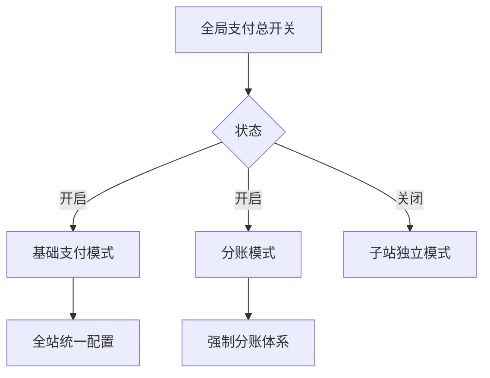
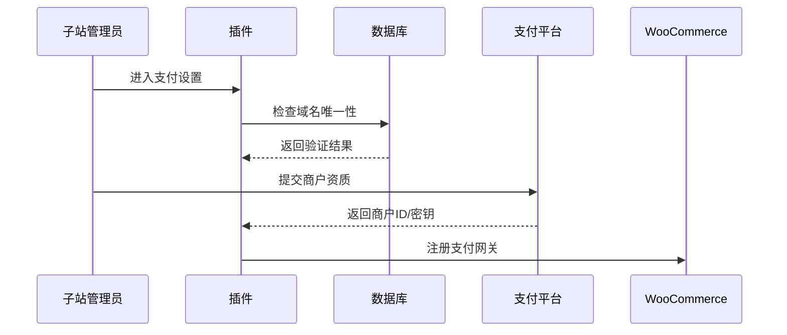
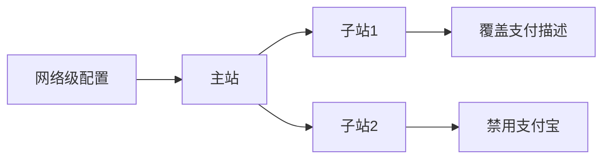
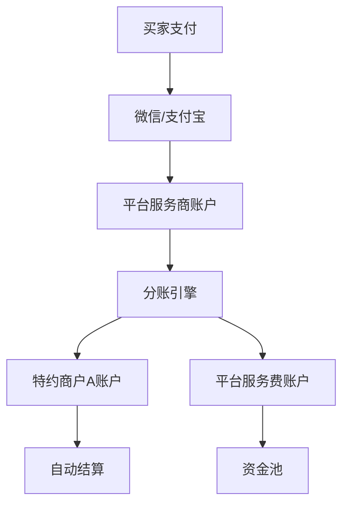
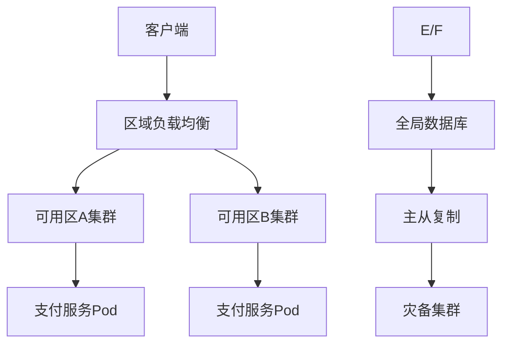

# WordPress多站点WooCommerce微信支付宝支付插件需求分析文档（V5.0）

---

## **1. 全局模式控制体系**

### **1.1 独立开关设计**


#### **1.1.1 开关组合规则**
| **全局支付** | **分账模式** | **子站权限**                                                                 | **支付流向**                    |
|--------------|--------------|-----------------------------------------------------------------------------|---------------------------------|
| ON           | OFF          | 可独立配置或继承全站配置                                                     | 直接支付至平台主商户            |
| ON           | ON           | 仅能管理分账规则，禁用本地配置                                               | 支付至卖家特约商户账户          |
| OFF          | -            | 完全独立配置                                                                | 直接支付至子站绑定商户          |

#### **1.1.2 技术实现**
```php
// 开关状态管理类
class GlobalSwitch {
    private $payment_enabled;
    private $split_mode;

    public function __construct() {
        $this->payment_enabled = get_network_option(null, 'global_payment_enabled');
        $this->split_mode = get_network_option(null, 'split_mode_enabled');
    }

    public function isSplitModeActive() {
        return $this->payment_enabled && $this->split_mode;
    }

    public function allowLocalConfig($blog_id) {
        if (!$this->payment_enabled) return true;
        return get_blog_option($blog_id, 'override_global_config');
    }
}
```

---

## **2. 核心模式技术实现**

### **2.1 模式一：子站独立激活**
#### **2.1.1 独立域名绑定流程**


#### **2.1.2 数据隔离设计**
- **数据库表结构**：
  ```sql
  CREATE TABLE site_payment_config (
    blog_id BIGINT PRIMARY KEY,
    wechat_mch_id VARCHAR(32),
    wechat_cert BLOB,
    alipay_app_id VARCHAR(32),
    alipay_private_key TEXT,
    payment_domain VARCHAR(255) UNIQUE
  ) ENGINE=InnoDB DEFAULT CHARSET=utf8mb4;
  ```

- **加密策略**：
  ```php
  // 使用WordPress密钥加密敏感字段
  function encryptField($value) {
      $iv = substr(LOGGED_IN_SALT, 0, 16);
      return openssl_encrypt($value, 'AES-256-CBC', AUTH_KEY, 0, $iv);
  }
  ```

---

### **2.2 模式二：全局基础支付**
#### **2.2.1 配置继承机制**


#### **2.2.2 子站控制项实现**
- **权限控制代码**：
  ```php
  add_filter('woocommerce_settings_api_form_fields', function($fields, $gateway) {
      if (GlobalSwitch::isGlobalModeActive()) {
          unset($fields['mch_id'], $fields['api_key'], $fields['cert']);
          $fields['enabled']['description'] = '继承全局配置，仅可开关渠道';
      }
      return $fields;
  }, 10, 2);
  ```

- **配置覆盖逻辑**：
  ```sql
  -- 获取最终配置的优先级
  SELECT 
      COALESCE(s.override_value, n.default_value) AS final_value
  FROM network_config n
  LEFT JOIN site_overrides s 
      ON n.config_key = s.config_key AND s.blog_id = ?
  WHERE n.gateway = 'wechat';
  ```

---

### **2.3 模式三：分账模式**
#### **2.3.1 分账架构设计**


#### **2.3.2 分账规则引擎**
**规则类型与参数**：
| **类型**       | **参数结构**                                                                 | **示例场景**                |
|----------------|-----------------------------------------------------------------------------|---------------------------|
| 固定比例       | `{ "type": "ratio", "platform": 30, "merchant": 70 }`                       | 平台抽成30%               |
| 阶梯分账       | `{ "type": "step", "steps": [{"min":0,"max":1000,"platform":20}, ...] }`    | 0-1000元平台抽20%         |
| 固定服务费     | `{ "type": "fixed", "amount": 5 }`                                          | 每笔订单收取5元服务费      |

**分账执行代码**：
```python
def execute_split(order):
    rule = get_split_rule(order.blog_id)
    total = order.amount
    # 计算平台分成
    platform_share = calculate_platform_share(rule, total)
    # 调用支付平台API
    response = wechat.split_order(
        order.transaction_id, 
        platform_share,
        order.merchant.mch_id
    )
    if response['status'] == 'SUCCESS':
        log_split_success(order)
    else:
        handle_split_failure(order, response)
```

#### **2.3.3 特约商户管理**
**资质审核流程**：
1. **材料上传**：
   ```html
   <!-- 商户后台界面 -->
   <div class="merchant-verify">
     <h3>特约商户认证</h3>
     <input type="file" name="license" accept=".pdf,.jpg">
     <input type="text" name="legal_id" placeholder="法人身份证号">
     <button onclick="submitVerify()">提交审核</button>
   </div>
   ```

2. **自动审核接口**：
   ```javascript
   // 调用微信审核接口
   fetch('https://api.wechat.com/v3/sub-merchants', {
     method: 'POST',
     headers: {
       'Authorization': `Bearer ${accessToken}`,
       'Content-Type': 'application/json'
     },
     body: JSON.stringify({
       business_license: base64Data,
       identity_info: {
         id_number: legalId
       }
     })
   });
   ```

3. **人工复核机制**：
   ```php
   add_action('merchant_submitted', function($merchant_id) {
       $application = get_merchant_application($merchant_id);
       if ($application['risk_level'] > 5) {
           add_to_manual_review_queue($merchant_id);
           notify_admin("高风险申请需人工审核");
       }
   });
   ```

---

## **3. 异常处理与监控体系**

### **3.1 分账失败处理**
#### **3.1.1 错误分类与策略**
| **错误类型**       | **自动处理策略**                          | **人工干预场景**              |
|--------------------|------------------------------------------|-----------------------------|
| 余额不足           | 暂停分账并通知商户充值                    | 连续3次失败需人工确认        |
| 账户冻结           | 自动禁用该商户支付功能                    | 需联系支付平台解冻           |
| 网络超时           | 指数退避重试（最多5次）                   | 超过重试次数后报警           |

#### **3.1.2 自动补偿机制**
```java
public void retryFailedSplits() {
    List<FailedSplit> failures = getRecentFailures();
    for (FailedSplit failure : failures) {
        if (failure.retryCount < MAX_RETRY) {
            boolean success = retrySplit(failure);
            if (success) {
                markAsResolved(failure);
            } else {
                incrementRetryCount(failure);
            }
        } else {
            escalateToManual(failure);
        }
    }
}
```

### **3.2 资金安全监控**
#### **3.2.1 对账流程**
1. **数据采集**：
   ```bash
   # 每日凌晨下载对账单
   curl -X GET "https://api.alipay.com/gateway.do?method=alipay.data.bill.download" \
        -d "bill_type=trade&bill_date=$(date +%Y-%m-%d)"
   ```

2. **差异检测**：
   ```sql
   -- 比对本地与支付平台记录
   SELECT 
       l.order_id,
       l.amount AS local_amount,
       p.amount AS platform_amount,
       (l.amount - p.amount) AS diff
   FROM local_orders l
   JOIN platform_orders p ON l.tx_id = p.tx_id
   WHERE ABS(diff) > 0.01;
   ```

3. **异常处理**：
   ```python
   def reconcile_discrepancy(order_id):
       local = get_local_order(order_id)
       platform = get_platform_order(order_id)
       if local.status != platform.status:
           reverse_transaction(local)
           create_new_transaction(platform)
       log_reconciliation_result(order_id)
   ```

---

## **4. 安全与合规设计**

### **4.1 数据安全架构**
| **数据类型**       | **存储方式**             | **加密方法**               | **访问控制**                      |
|--------------------|--------------------------|--------------------------|----------------------------------|
| API密钥            | 独立加密存储             | AES-256-GCM + HSM        | 仅支付服务进程可读                |
| 交易日志           | 冷热分离存储             | 字段级加密                | 审计角色只读                     |
| 商户资质文件       | 对象存储（OSS）          | 服务端加密（SSE）         | 上传者+管理员可访问              |

### **4.2 合规性要求**
- **微信支付服务商规范**：
  - 分账比例需在签约时明确约定
  - 特约商户资质必须通过官方接口审核
  - 每笔分账需保留完整可追溯记录

- **支付宝服务商协议**：
  - 不得修改交易信息中的商户名称
  - 分账请求需在交易后30天内完成
  - 需提供分账争议处理接口

---

## **5. 部署与运维方案**

### **5.1 多环境配置**
```yaml
# docker-compose.yml片段
services:
  payment-service:
    environment:
      - APP_ENV=production
      - WECHAT_MCH_ID=${WECHAT_MCH_ID}
      - ALIPAY_APP_ID=${ALIPAY_APP_ID}
    configs:
      - source: payment-config
        target: /app/config/secure.yaml
```

### **5.2 高可用架构**


---

