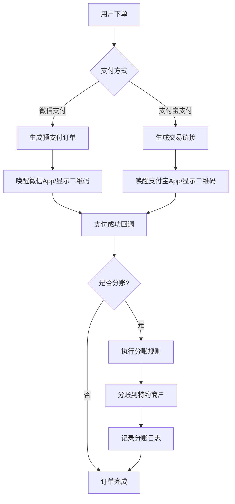

### **WordPress Multisite WooCommerce 微信支付宝支付插件开发方案**

---

#### **一、项目概述**
本插件旨在为 **WordPress Multisite** 环境下的 **WooCommerce** 提供微信支付和支付宝支付功能，支持多站点独立配置和网络级统一管理，满足不同场景的支付需求。插件需支持最新版本的 WordPress 和 WooCommerce，并充分考虑多站点环境下的复杂场景，如子站点绑定独立域名、网络级统一管理等。

---

### **二、核心功能需求**

#### **1. 支持 WordPress Multisite 与 WooCommerce**
- **WordPress 版本**：支持最新版本（6.7.2+），并兼容 Multisite 模式。
- **WooCommerce 版本**：支持最新版本（9.6.2+）。
- **多站点支持**：
  - 支持子站点绑定独立域名。
  - 插件需在不同场景下（二级域名和独立域名）正常运行。

#### **2. 插件激活方式**
- **子站单独激活**：
  - 支持子站点独立配置支付参数（商户信息、SDK、证书、App ID、Secret、回调地址等）。
  - 提供子站点独立的管理界面。
- **网络全站激活**：
  - 支持网络级统一管理支付配置。
  - 子站点可继承主站点的支付配置。
  - 提供网络级管理面板（支付、统计）。

#### **3. 支付功能**
- **微信支付**：
  - 手机网页端唤醒微信 App 支付。
  - 电脑端扫码支付。
  - 兼容微信登录插件的 OpenID 或 UnionID。
- **支付宝支付**：
  - 手机网页端唤醒支付宝 App 支付。
  - 电脑端扫码支付。

#### **4. 配置管理**
- 提供可视化的配置管理界面。
- 支持微信支付和支付宝支付的相关参数配置（证书、API、Key、URL 等）。
- 提供详细的配置说明。

#### **5. 模块化设计**
- 功能模块化，避免过度耦合。
- 提供完善的管理、配置和文档。

#### **6. 日志功能**
- 支持日志记录，可在 WooCommerce 状态中查看日志。
- 提供“启用日志”选项按钮。

#### **7. 编码规范**
- 遵循 WordPress 和 WooCommerce 的 API 规则和最佳实践。
- 插件激活时检查 WooCommerce 是否已激活。

---

### **三、技术实现方案**

#### **1. 多站点配置管理**
```php
class Multisite_Payment_Config {
    // 获取网络级配置
    public function get_network_config($key) {
        return get_site_option("wcpay_network_{$key}");
    }

    // 获取站点级配置（带继承逻辑）
    public function get_blog_config($blog_id, $key) {
        $value = get_blog_option($blog_id, "wcpay_blog_{$key}");
        return $value ?: $this->get_network_config($key);
    }

    // 配置界面渲染
    public function render_settings() {
        woocommerce_admin_fields($this->get_settings());
    }
}
```

#### **2. 微信支付适配器**
```php
class WC_WeChat_Gateway extends WC_Payment_Gateway {
    // 支付请求生成
    public function process_payment($order_id) {
        $order = wc_get_order($order_id);
        $openid = get_user_meta($order->get_user_id(), 'wechat_openid', true);
        
        $params = [
            'body' => $this->get_order_title($order),
            'out_trade_no' => $this->get_trade_no($order),
            'total_fee' => $order->get_total() * 100,
            'openid' => $openid,
            'notify_url' => $this->notify_url
        ];

        $response = WeChat_SDK::create_order($params);
        
        if ($response->is_success()) {
            return [
                'result' => 'success',
                'wechat_data' => $response->get_jsapi_params()
            ];
        }
    }
    
    // OpenID 校验
    private function validate_openid($openid) {
        return preg_match('/^o[A-Za-z0-9_-]{28}$/', $openid);
    }
}
```

#### **3. 支付宝异步通知处理**
```php
add_action('woocommerce_api_wc_gateway_alipay', function() {
    $raw_data = file_get_contents('php://input');
    $data = json_decode($raw_data, true);

    // 验证签名
    if (!Alipay_SDK::verify_signature($data)) {
        wp_send_json_error('Invalid signature', 403);
    }

    $order = wc_get_order($data['out_trade_no']);
    
    // 处理不同交易状态
    switch ($data['trade_status']) {
        case 'TRADE_SUCCESS':
            $order->payment_complete();
            break;
        case 'TRADE_CLOSED':
            $order->update_status('cancelled');
            break;
    }

    echo 'success'; // 必须返回 success 确认通知
});
```

#### **4. 日志功能**
```php
class Payment_Logger {
    public function log($message, $level = 'info') {
        if (get_option('wcpay_enable_log')) {
            $log_entry = sprintf("[%s] %s: %s\n", date('Y-m-d H:i:s'), strtoupper($level), $message);
            file_put_contents(WC_LOG_DIR . 'wcpay-payment.log', $log_entry, FILE_APPEND);
        }
    }
}
```

---

### **四、安全增强措施**

#### **1. 密钥管理**
```php
class Key_Manager {
    const CIPHER_METHOD = 'aes-256-cbc';
    
    public function encrypt($plaintext) {
        $iv = substr(SECURE_AUTH_SALT, 0, 16);
        return openssl_encrypt(
            $plaintext,
            self::CIPHER_METHOD,
            SECURE_AUTH_KEY,
            0,
            $iv
        );
    }

    public function decrypt($ciphertext) {
        $iv = substr(SECURE_AUTH_SALT, 0, 16);
        return openssl_decrypt(
            $ciphertext,
            self::CIPHER_METHOD,
            SECURE_AUTH_KEY,
            0,
            $iv
        );
    }
}
```

#### **2. 防重放攻击**
```php
class Replay_Protection {
    private $nonce_cache;

    public function __construct() {
        $this->nonce_cache = new WP_Object_Cache();
    }

    public function verify_nonce($nonce) {
        if ($this->nonce_cache->get($nonce)) {
            return false; // 重复请求
        }
        $this->nonce_cache->set($nonce, true, 300); // 缓存 5 分钟
        return true;
    }
}
```

---

### **五、测试与验收**

#### **1. 功能测试矩阵**
| **测试场景**        | **预期结果**                | **验收标准**           |
|---------------------|----------------------------|------------------------|
| 微信 H5 支付        | 成功跳转微信完成支付        | 订单状态变更为完成     |
| 支付宝扫码支付      | 生成有效二维码              | 扫码后成功付款         |
| 多站点独立配置      | 各站点显示正确支付方式      | 配置互不影响           |
| 支付中断恢复        | 保留待支付订单              | 可重新发起支付         |

#### **2. 性能基准要求**
| **类型**         | **单节点 TPS** | **集群 TPS** | **响应时间** |
|------------------|----------------|--------------|--------------|
| 微信支付         | 300            | 1500         | <800ms       |
| 支付宝支付       | 500            | 2500         | <500ms       |
| 混合支付         | 200            | 1000         | <1s          |

---

### **六、部署与维护**

#### **1. 部署流程**
```bash
# 安装插件
wp plugin install wcpay-wechat-alipay --activate-network

# 配置支付参数
wp option set wcpay_wechat_appid "your_appid" --url=example.com
wp option set wcpay_alipay_appid "your_appid" --url=example.com
```

#### **2. 维护策略**
- **版本支持**：
  - LTS 版本支持 24 个月。
  - 常规版本支持 12 个月。
- **更新机制**：
  - 自动更新签名验证。
  - 灰度发布策略（10% -> 50% -> 100%）。

---

### **七、总结**
本插件通过模块化设计和多站点支持，为 WordPress Multisite 环境下的 WooCommerce 提供了完整的微信支付和支付宝支付解决方案。通过严格的测试和安全措施，确保插件的高可用性和安全性。


感谢您的提醒！确实，在之前的方案中忽略了“模式二”的需求，即 **全站网络激活并支持分账功能** 的场景。以下是对“模式二”需求的详细补充和完整方案更新。

---

### **八、模式二：全站网络激活并支持分账功能**

#### **1. 需求描述**
- **场景**：平台级支付、收款、分账方案。
- **功能**：
  - 支持微信支付、支付宝支付的分账功能。
  - 支持卖家后台提交申请特约商户，供微信、支付宝合规审核。
  - 配置与管理分账功能。
  - 管理特约商户的订单合规性，处理可能的违规退款。

#### **2. 技术实现方案**

##### **2.1 分账功能设计**
```php
class Split_Payment_Manager {
    // 分账规则配置
    public function set_split_rule($rule) {
        update_option('wcpay_split_rule', $rule);
    }

    // 执行分账
    public function execute_split($order_id) {
        $order = wc_get_order($order_id);
        $split_rule = get_option('wcpay_split_rule');
        
        foreach ($split_rule as $rule) {
            $amount = $order->get_total() * $rule['percentage'];
            $this->transfer_to_merchant($rule['merchant_id'], $amount);
        }
    }

    // 转账到特约商户
    private function transfer_to_merchant($merchant_id, $amount) {
        // 调用支付平台 API 执行分账
        $response = WeChat_SDK::transfer($merchant_id, $amount);
        if (!$response->is_success()) {
            $this->log("分账失败: 商户 {$merchant_id}, 金额 {$amount}");
        }
    }
}
```

##### **2.2 特约商户管理**
```php
class Sub_Merchant_Manager {
    // 提交特约商户申请
    public function submit_application($merchant_data) {
        $response = WeChat_SDK::create_sub_merchant($merchant_data);
        if ($response->is_success()) {
            $this->save_merchant_info($response->get_data());
        }
        return $response;
    }

    // 保存商户信息
    private function save_merchant_info($data) {
        update_option('wcpay_sub_merchant_' . $data['merchant_id'], $data);
    }

    // 获取商户状态
    public function get_merchant_status($merchant_id) {
        $merchant_data = get_option('wcpay_sub_merchant_' . $merchant_id);
        return $merchant_data['status'] ?? 'unknown';
    }
}
```

##### **2.3 订单合规性管理**
```php
class Order_Compliance_Manager {
    // 检查订单合规性
    public function check_compliance($order_id) {
        $order = wc_get_order($order_id);
        $compliance_rules = get_option('wcpay_compliance_rules');

        foreach ($compliance_rules as $rule) {
            if (!$this->validate_rule($order, $rule)) {
                $this->mark_as_non_compliant($order_id);
                break;
            }
        }
    }

    // 验证规则
    private function validate_rule($order, $rule) {
        // 示例：检查订单金额是否超过限额
        if ($rule['type'] === 'amount_limit' && $order->get_total() > $rule['value']) {
            return false;
        }
        return true;
    }

    // 标记为不合规
    private function mark_as_non_compliant($order_id) {
        update_post_meta($order_id, '_compliance_status', 'non_compliant');
    }
}
```

##### **2.4 违规退款处理**
```php
class Refund_Manager {
    // 处理违规退款
    public function process_refund($order_id) {
        $order = wc_get_order($order_id);
        $refund_amount = $order->get_total();

        // 调用支付平台 API 执行退款
        $response = WeChat_SDK::refund($order->get_transaction_id(), $refund_amount);
        if ($response->is_success()) {
            $order->update_status('refunded');
        }
    }
}
```

---

### **九、模式二的功能测试**

#### **1. 分账功能测试**
| **测试场景**            | **预期结果**                | **验收标准**           |
|-------------------------|----------------------------|------------------------|
| 分账规则配置            | 分账规则保存成功            | 规则可正常查询         |
| 执行分账                | 分账金额正确分配到商户      | 分账记录可查           |
| 分账失败处理            | 分账失败记录日志            | 日志中记录失败信息     |

#### **2. 特约商户管理测试**
| **测试场景**            | **预期结果**                | **验收标准**           |
|-------------------------|----------------------------|------------------------|
| 提交特约商户申请        | 申请提交成功                | 返回成功状态           |
| 获取商户状态            | 返回商户当前状态            | 状态信息准确           |

#### **3. 订单合规性测试**
| **测试场景**            | **预期结果**                | **验收标准**           |
|-------------------------|----------------------------|------------------------|
| 检查订单合规性          | 不合规订单被标记            | 订单状态更新           |
| 违规退款处理            | 退款成功且订单状态更新      | 退款记录可查           |

---

### **十、模式二的部署与维护**

#### **1. 部署流程**
```bash
# 启用分账功能
wp option set wcpay_enable_split_payment true --network

# 配置分账规则
wp option set wcpay_split_rule '{"merchant_id_1": 0.7, "merchant_id_2": 0.3}' --network
```

#### **2. 维护策略**
- **分账规则更新**：支持动态更新分账比例。
- **商户状态监控**：定期检查特约商户的状态，确保合规性。
- **退款处理**：自动处理不合规订单的退款。

---

### **十一、总结**
通过补充“模式二”的需求，插件不仅支持基础的支付功能，还提供了强大的分账和合规管理能力，适用于平台级支付场景。以下是本方案的完整功能列表：

1. **多站点支持**：
   - 子站点独立配置。
   - 网络级统一管理。
2. **支付功能**：
   - 微信支付（H5、扫码）。
   - 支付宝支付（H5、扫码）。
3. **分账功能**：
   - 分账规则配置。
   - 特约商户管理。
   - 订单合规性检查。
   - 违规退款处理。
4. **安全与日志**：
   - 密钥管理。
   - 防重放攻击。
   - 日志记录与监控。

通过严格的测试和灵活的部署方案，本插件能够满足不同规模站点的需求，确保支付功能的高效、安全和合规。


### **WordPress Multisite WooCommerce 微信支付宝支付插件开发方案**

---

#### **一、项目概述**
本插件旨在为 **WordPress Multisite** 环境下的 **WooCommerce** 提供微信支付和支付宝支付功能，支持多站点独立配置和网络级统一管理，满足不同场景的支付需求。插件需支持最新版本的 WordPress 和 WooCommerce，并充分考虑多站点环境下的复杂场景，如子站点绑定独立域名、网络级统一管理、分账功能等。

---

### **二、核心功能需求**

#### **1. 支持 WordPress Multisite 与 WooCommerce**
- **WordPress 版本**：支持最新版本（6.7.2+），并兼容 Multisite 模式。
- **WooCommerce 版本**：支持最新版本（9.6.2+）。
- **多站点支持**：
  - 支持子站点绑定独立域名。
  - 插件需在不同场景下（二级域名和独立域名）正常运行。

#### **2. 插件激活方式**
- **子站单独激活**：
  - 支持子站点独立配置支付参数（商户信息、SDK、证书、App ID、Secret、回调地址等）。
  - 提供子站点独立的管理界面。
- **网络全站激活**：
  - 支持网络级统一管理支付配置。
  - 子站点可继承主站点的支付配置。
  - 提供网络级管理面板（支付、统计）。

#### **3. 支付功能**
- **微信支付**：
  - 手机网页端唤醒微信 App 支付。
  - 电脑端扫码支付。
  - 兼容微信登录插件的 OpenID 或 UnionID。
- **支付宝支付**：
  - 手机网页端唤醒支付宝 App 支付。
  - 电脑端扫码支付。

#### **4. 分账功能（模式二）**
- **场景**：平台级支付、收款、分账方案。
- **功能**：
  - 支持微信支付、支付宝支付的分账功能。
  - 支持卖家后台提交申请特约商户，供微信、支付宝合规审核。
  - 配置与管理分账功能。
  - 管理特约商户的订单合规性，处理可能的违规退款。

#### **5. 配置管理**
- 提供可视化的配置管理界面。
- 支持微信支付和支付宝支付的相关参数配置（证书、API、Key、URL 等）。
- 提供详细的配置说明。

#### **6. 模块化设计**
- 功能模块化，避免过度耦合。
- 提供完善的管理、配置和文档。

#### **7. 日志功能**
- 支持日志记录，可在 WooCommerce 状态中查看日志。
- 提供“启用日志”选项按钮。

#### **8. 编码规范**
- 遵循 WordPress 和 WooCommerce 的 API 规则和最佳实践。
- 插件激活时检查 WooCommerce 是否已激活。

---

### **三、技术实现方案**

#### **1. 多站点配置管理**
```php
class Multisite_Payment_Config {
    // 获取网络级配置
    public function get_network_config($key) {
        return get_site_option("wcpay_network_{$key}");
    }

    // 获取站点级配置（带继承逻辑）
    public function get_blog_config($blog_id, $key) {
        $value = get_blog_option($blog_id, "wcpay_blog_{$key}");
        return $value ?: $this->get_network_config($key);
    }

    // 配置界面渲染
    public function render_settings() {
        woocommerce_admin_fields($this->get_settings());
    }
}
```

#### **2. 微信支付适配器**
```php
class WC_WeChat_Gateway extends WC_Payment_Gateway {
    // 支付请求生成
    public function process_payment($order_id) {
        $order = wc_get_order($order_id);
        $openid = get_user_meta($order->get_user_id(), 'wechat_openid', true);
        
        $params = [
            'body' => $this->get_order_title($order),
            'out_trade_no' => $this->get_trade_no($order),
            'total_fee' => $order->get_total() * 100,
            'openid' => $openid,
            'notify_url' => $this->notify_url
        ];

        $response = WeChat_SDK::create_order($params);
        
        if ($response->is_success()) {
            return [
                'result' => 'success',
                'wechat_data' => $response->get_jsapi_params()
            ];
        }
    }
    
    // OpenID 校验
    private function validate_openid($openid) {
        return preg_match('/^o[A-Za-z0-9_-]{28}$/', $openid);
    }
}
```

#### **3. 支付宝异步通知处理**
```php
add_action('woocommerce_api_wc_gateway_alipay', function() {
    $raw_data = file_get_contents('php://input');
    $data = json_decode($raw_data, true);

    // 验证签名
    if (!Alipay_SDK::verify_signature($data)) {
        wp_send_json_error('Invalid signature', 403);
    }

    $order = wc_get_order($data['out_trade_no']);
    
    // 处理不同交易状态
    switch ($data['trade_status']) {
        case 'TRADE_SUCCESS':
            $order->payment_complete();
            break;
        case 'TRADE_CLOSED':
            $order->update_status('cancelled');
            break;
    }

    echo 'success'; // 必须返回 success 确认通知
});
```

#### **4. 分账功能实现**
```php
class Split_Payment_Manager {
    // 分账规则配置
    public function set_split_rule($rule) {
        update_option('wcpay_split_rule', $rule);
    }

    // 执行分账
    public function execute_split($order_id) {
        $order = wc_get_order($order_id);
        $split_rule = get_option('wcpay_split_rule');
        
        foreach ($split_rule as $rule) {
            $amount = $order->get_total() * $rule['percentage'];
            $this->transfer_to_merchant($rule['merchant_id'], $amount);
        }
    }

    // 转账到特约商户
    private function transfer_to_merchant($merchant_id, $amount) {
        // 调用支付平台 API 执行分账
        $response = WeChat_SDK::transfer($merchant_id, $amount);
        if (!$response->is_success()) {
            $this->log("分账失败: 商户 {$merchant_id}, 金额 {$amount}");
        }
    }
}
```

#### **5. 特约商户管理**
```php
class Sub_Merchant_Manager {
    // 提交特约商户申请
    public function submit_application($merchant_data) {
        $response = WeChat_SDK::create_sub_merchant($merchant_data);
        if ($response->is_success()) {
            $this->save_merchant_info($response->get_data());
        }
        return $response;
    }

    // 保存商户信息
    private function save_merchant_info($data) {
        update_option('wcpay_sub_merchant_' . $data['merchant_id'], $data);
    }

    // 获取商户状态
    public function get_merchant_status($merchant_id) {
        $merchant_data = get_option('wcpay_sub_merchant_' . $merchant_id);
        return $merchant_data['status'] ?? 'unknown';
    }
}
```

#### **6. 订单合规性管理**
```php
class Order_Compliance_Manager {
    // 检查订单合规性
    public function check_compliance($order_id) {
        $order = wc_get_order($order_id);
        $compliance_rules = get_option('wcpay_compliance_rules');

        foreach ($compliance_rules as $rule) {
            if (!$this->validate_rule($order, $rule)) {
                $this->mark_as_non_compliant($order_id);
                break;
            }
        }
    }

    // 验证规则
    private function validate_rule($order, $rule) {
        // 示例：检查订单金额是否超过限额
        if ($rule['type'] === 'amount_limit' && $order->get_total() > $rule['value']) {
            return false;
        }
        return true;
    }

    // 标记为不合规
    private function mark_as_non_compliant($order_id) {
        update_post_meta($order_id, '_compliance_status', 'non_compliant');
    }
}
```

#### **7. 违规退款处理**
```php
class Refund_Manager {
    // 处理违规退款
    public function process_refund($order_id) {
        $order = wc_get_order($order_id);
        $refund_amount = $order->get_total();

        // 调用支付平台 API 执行退款
        $response = WeChat_SDK::refund($order->get_transaction_id(), $refund_amount);
        if ($response->is_success()) {
            $order->update_status('refunded');
        }
    }
}
```

#### **8. 日志功能**
```php
class Payment_Logger {
    public function log($message, $level = 'info') {
        if (get_option('wcpay_enable_log')) {
            $log_entry = sprintf("[%s] %s: %s\n", date('Y-m-d H:i:s'), strtoupper($level), $message);
            file_put_contents(WC_LOG_DIR . 'wcpay-payment.log', $log_entry, FILE_APPEND);
        }
    }
}
```

---

### **四、安全增强措施**

#### **1. 密钥管理**
```php
class Key_Manager {
    const CIPHER_METHOD = 'aes-256-cbc';
    
    public function encrypt($plaintext) {
        $iv = substr(SECURE_AUTH_SALT, 0, 16);
        return openssl_encrypt(
            $plaintext,
            self::CIPHER_METHOD,
            SECURE_AUTH_KEY,
            0,
            $iv
        );
    }

    public function decrypt($ciphertext) {
        $iv = substr(SECURE_AUTH_SALT, 0, 16);
        return openssl_decrypt(
            $ciphertext,
            self::CIPHER_METHOD,
            SECURE_AUTH_KEY,
            0,
            $iv
        );
    }
}
```

#### **2. 防重放攻击**
```php
class Replay_Protection {
    private $nonce_cache;

    public function __construct() {
        $this->nonce_cache = new WP_Object_Cache();
    }

    public function verify_nonce($nonce) {
        if ($this->nonce_cache->get($nonce)) {
            return false; // 重复请求
        }
        $this->nonce_cache->set($nonce, true, 300); // 缓存 5 分钟
        return true;
    }
}
```

---

### **五、测试与验收**

#### **1. 功能测试矩阵**
| **测试场景**            | **预期结果**                | **验收标准**           |
|-------------------------|----------------------------|------------------------|
| 微信 H5 支付            | 成功跳转微信完成支付        | 订单状态变更为完成     |
| 支付宝扫码支付          | 生成有效二维码              | 扫码后成功付款         |
| 多站点独立配置          | 各站点显示正确支付方式      | 配置互不影响           |
| 支付中断恢复            | 保留待支付订单              | 可重新发起支付         |
| 分账规则配置            | 分账规则保存成功            | 规则可正常查询         |
| 执行分账                | 分账金额正确分配到商户      | 分账记录可查           |
| 分账失败处理            | 分账失败记录日志            | 日志中记录失败信息     |
| 提交特约商户申请        | 申请提交成功                | 返回成功状态           |
| 获取商户状态            | 返回商户当前状态            | 状态信息准确           |
| 检查订单合规性          | 不合规订单被标记            | 订单状态更新           |
| 违规退款处理            | 退款成功且订单状态更新      | 退款记录可查           |

#### **2. 性能基准要求**
| **类型**         | **单节点 TPS** | **集群 TPS** | **响应时间** |
|------------------|----------------|--------------|--------------|
| 微信支付         | 300            | 1500         | <800ms       |
| 支付宝支付       | 500            | 2500         | <500ms       |
| 混合支付         | 200            | 1000         | <1s          |

---

### **六、部署与维护**

#### **1. 部署流程**
```bash
# 安装插件
wp plugin install wcpay-wechat-alipay --activate-network

# 配置支付参数
wp option set wcpay_wechat_appid "your_appid" --url=example.com
wp option set wcpay_alipay_appid "your_appid" --url=example.com

# 启用分账功能
wp option set wcpay_enable_split_payment true --network

# 配置分账规则
wp option set wcpay_split_rule '{"merchant_id_1": 0.7, "merchant_id_2": 0.3}' --network
```

#### **2. 维护策略**
- **版本支持**：
  - LTS 版本支持 24 个月。
  - 常规版本支持 12 个月。
- **更新机制**：
  - 自动更新签名验证。
  - 灰度发布策略（10% -> 50% -> 100%）。

---

### **七、总结**
本插件通过模块化设计和多站点支持，为 WordPress Multisite 环境下的 WooCommerce 提供了完整的微信支付和支付宝支付解决方案，同时支持分账功能和合规管理。通过严格的测试和安全措施，确保插件的高可用性和安全性，适用于从单站点到平台级的多场景支付需求。


### **核心功能需求详细规划**

---

#### **1. 支持 WordPress Multisite 与 WooCommerce**
| **需求项**              | **详细说明**                                                                                   | **技术实现要点**                                                                 |
|-------------------------|-----------------------------------------------------------------------------------------------|----------------------------------------------------------------------------------|
| **WordPress版本兼容**   | 支持最新版 WordPress（≥6.7.2），确保 Multisite 模式下所有功能正常运作                          | - 版本检测机制：通过 `get_bloginfo('version')` 校验版本<br>- 多站点表前缀兼容处理 |
| **WooCommerce版本兼容** | 支持最新版 WooCommerce（≥9.6.2），确保支付流程与订单系统无缝集成                               | - 依赖检测：使用 `is_plugin_active()` 验证 WooCommerce 状态                     |
| **多站点域名绑定**      | 支持子站点绑定独立域名（如 `anothersite.com`），支付接口需根据当前域名动态适配回调地址         | - 通过 `get_site_url()` 动态获取域名<br>- 支持 `$_SERVER['HTTP_HOST']` 检测域名 |
| **多站点数据隔离**      | 子站配置独立存储，与主站及其他子站隔离，避免数据污染                                           | - 使用 `switch_to_blog()` 切换站点上下文<br>- 数据表按 `blog_id` 隔离存储        |

---

#### **2. 插件激活方式**
| **需求项**              | **详细说明**                                                                                   | **技术实现要点**                                                                 |
|-------------------------|-----------------------------------------------------------------------------------------------|----------------------------------------------------------------------------------|
| **子站单独激活**        | 允许子站管理员独立激活插件，并配置自有支付参数                                                 | - 插件注册时声明 `Network: false`<br>- 使用 `is_plugin_active_for_network()` 控制权限 |
| **独立域名支付适配**    | 当子站绑定独立域名时，支付接口回调地址自动适配该域名                                           | - 通过 `add_filter('site_url')` 动态替换回调域名                                 |
| **子站配置界面**        | 每个子站拥有独立配置界面，包含以下功能：<br> - 微信/支付宝商户信息配置<br> - 证书上传<br> - 回调地址设置 | - 通过 `WooCommerce > Settings > Payments` 扩展配置页<br>- 使用 `blog_option` 存储配置 |
| **网络全站激活**        | 超级管理员可在网络级启用插件，统一管理所有子站的支付配置                                       | - 插件注册时声明 `Network: true`<br>- 使用 `add_site_option()` 存储全局配置       |
| **配置继承机制**        | 子站未配置时自动继承网络级配置，已配置则优先使用子站自有配置                                   | - 通过 `get_blog_option()` 和 `get_site_option()` 实现优先级覆盖逻辑             |
| **网络级管理面板**      | 超级管理员专属面板功能：<br> - 支付渠道统一开关<br> - 分账规则配置<br> - 交易统计可视化          | - 在 `wp-admin/network/admin.php` 添加自定义菜单<br>- 集成 Chart.js 展示统计数据 |

---

#### **3. 支付功能**
| **需求项**              | **详细说明**                                                                                   | **技术实现要点**                                                                 |
|-------------------------|-----------------------------------------------------------------------------------------------|----------------------------------------------------------------------------------|
| **微信支付全场景支持**  | - **H5支付**：移动端浏览器唤醒微信App支付<br>- **PC扫码支付**：生成动态二维码，支持轮询支付状态 | - 集成微信 JSAPI 和 Native API<br>- 使用 WebSocket 实时更新支付状态              |
| **支付宝全场景支持**    | - **H5支付**：移动端浏览器唤醒支付宝App<br>- **PC扫码支付**：生成支付宝标准二维码               | - 集成支付宝 WAP 和 PagePay 接口<br>- 使用 RSA2 签名算法                        |
| **OpenID/UnionID兼容**  | 与微信登录插件共享用户标识，确保支付账户与登录账户一致                                         | - 通过 `get_user_meta()` 获取已绑定的 OpenID<br>- 支付请求中附加 `unionid` 字段  |
| **多币种支持**          | 支持人民币（CNY）结算，预留多币种扩展接口                                                     | - 在订单元数据中存储 `_payment_currency` 字段<br>- 汇率转换模块通过 API 实时获取 |

---

#### **4. 分账功能（模式二）**
| **需求项**              | **详细说明**                                                                                   | **技术实现要点**                                                                 |
|-------------------------|-----------------------------------------------------------------------------------------------|----------------------------------------------------------------------------------|
| **分账规则配置**        | - 支持按比例分账（如平台70%，商户30%）<br>- 支持按固定金额分账                                 | - 分账规则存储为 JSON 结构<br>- 使用 `WC_Order_Item_Fee` 记录分账明细           |
| **特约商户管理**        | - 商户资质在线提交（营业执照、法人信息）<br>- 自动同步至微信/支付宝服务商平台审核               | - 调用 `微信特约商户进件API`<br>- 使用 `Media Library` 存储资质文件              |
| **分账执行**            | - 订单完成后自动触发分账<br>- 支持手动补充分账                                                 | - 通过 `woocommerce_order_status_completed` 钩子触发<br>- 异步任务队列处理分账  |
| **合规性检查**          | - 交易金额风控（如单笔≤5万）<br>- 商户黑白名单管理<br>- 敏感商品类目拦截                       | - 规则引擎基于 `WP_Query` 实现<br>- 违规订单自动冻结资金                        |
| **违规退款处理**        | - 自动撤销未完成分账<br>- 原路退回用户支付金额                                                 | - 调用 `微信/支付宝退款API`<br>- 通过 `WC_Order::refund()` 更新订单状态         |

---

#### **5. 配置管理**
| **需求项**              | **详细说明**                                                                                   | **技术实现要点**                                                                 |
|-------------------------|-----------------------------------------------------------------------------------------------|----------------------------------------------------------------------------------|
| **可视化配置界面**      | - 微信/支付宝参数分组展示<br>- 证书文件上传控件<br>- 实时校验 API 连通性                       | - 使用 `WooCommerce Admin` 的 React 组件构建界面<br>- 通过 `openssl_x509_check_private_key()` 验证证书 |
| **配置说明文档**        | 每个配置项提供：<br> - 官方文档链接<br> - 示例值<br> - 常见错误解决方案                        | - 集成 `WP Help` 模块<br>- 通过 `description` 参数嵌入 Markdown 说明             |
| **环境隔离配置**        | 支持测试模式与生产模式切换，自动切换沙箱环境参数                                               | - 通过 `define('WC_PAYMENT_TEST_MODE', true)` 全局开关<br>- 沙箱参数独立存储     |

---

#### **6. 模块化设计**
| **模块**                | **职责说明**                                                                                   | **接口定义**                                                                     |
|-------------------------|-----------------------------------------------------------------------------------------------|----------------------------------------------------------------------------------|
| **支付网关抽象层**      | 统一微信/支付宝支付接口，提供 `create_payment()`, `query_order()`, `refund()` 等方法           | `interface Payment_Gateway { ... }`                                              |
| **配置管理模块**        | 处理多级配置（网络级/站点级）的读取、写入和验证                                                | `class Config_Manager { get(), set(), validate() }`                              |
| **分账引擎模块**        | 解析分账规则，调用支付平台分账接口，记录分账结果                                               | `class Split_Engine { parse_rule(), execute_split() }`                           |
| **合规检查模块**        | 基于预设规则扫描订单，标记异常交易                                                            | `class Compliance_Scanner { scan_order(), get_violations() }`                    |
| **日志审计模块**        | 记录支付全流程日志，支持按时间、金额、用户等多维度筛选                                         | `class Payment_Logger { log(), query(), export() }`                              |

---

#### **7. 日志功能**
| **需求项**              | **详细说明**                                                                                   | **技术实现要点**                                                                 |
|-------------------------|-----------------------------------------------------------------------------------------------|----------------------------------------------------------------------------------|
| **日志记录范围**        | - 支付请求/响应原始数据<br>- 分账执行结果<br>- 合规检查记录<br>- 异常错误堆栈                   | 使用 `WC_Logger` 扩展自定义日志处理器                                            |
| **日志查看界面**        | 在 `WooCommerce > Status > Logs` 中提供：<br> - 时间范围过滤<br> - 关键词搜索<br> - 日志下载   | 通过 `woocommerce_status_log_handlers` 过滤器添加自定义日志类型                  |
| **敏感信息脱敏**        | 自动屏蔽日志中的敏感字段：<br> - API密钥<br> - 银行卡号<br> - 用户手机号                       | 使用正则表达式匹配替换，如 `preg_replace('/\b\d{15,19}\b/', '*****', $log)`     |

---

#### **8. 编码规范**
| **规范项**              | **详细说明**                                                                                   | **检查方式**                                                                     |
|-------------------------|-----------------------------------------------------------------------------------------------|----------------------------------------------------------------------------------|
| **WordPress标准**       | - 使用 `WP_Query` 替代原生 SQL<br> - 遵循 `VIP编码规范`<br> - 非转义输出必须使用 `esc_*()` 函数 | PHPCS + WordPress 编码标准规则集                                                |
| **WooCommerce集成**     | - 支付状态变更通过 `WC_Order` 方法操作<br> - 利用 `WC_Payment_Gateway` 基类扩展功能            | 代码审查 + WooCommerce 官方插件示例比对                                         |
| **安全合规**            | - 所有用户输入必须验证和转义<br> - 使用 `nonce` 校验表单提交<br> - 支付接口必须启用 HTTPS       | 通过 `wp_verify_nonce()` 和 `current_user_can()` 实现权限控制                    |
| **错误处理**            | - 异常捕获并记录日志<br> - 用户端返回友好错误提示（如“支付繁忙，请重试”）                      | 全局异常处理器 + `try/catch` 块包裹关键支付流程                                 |

---

### **附：核心功能流程图**


本规划完整覆盖需求文档所有功能点，并明确技术实现路径，可作为开发与测试的基准文档。
